深入去思考、对比！这已经是多次看这个视频了

这次把 git 用好

#### 课程四个阶段(对于我的一个新的要求):

1. 第一阶段 用来回顾一下 react 的基础知识(结合 React 文档)，配合 TS 完成一个实验性网站
2. 实现一个标准电商的所需要的基础功能，比如，页面布局、项目架构、路由配置、数据调取、产品浏览等
3. 项目的架构思想、使用 redux 对项目重构、网站的全局状态管理、用户登录、购物车管理、下单结算功能 以及 react 高级用法
4. 前端项目的测试，使用 docker 来完成 react 项目的容器化部署，并使用阿里云完成项目的上线(使用 Docker 是一个项目亮点 需扩展来学习思考)

**带着问题来学习：**

1. **如何启动一个 react 项目？** npx create-react-app my-app
2. **如何启动一个 TS 版本的 React 项目？** npx create-react-app my-app --template typescript
3. **create-react-app 是什么？** 一个 react 的脚手架, 内置了 webpack
4. **npm 与 yarn 的区别是什么？** (有点意思，上次我遇见了这个问题，但没法完全想出来) 不同的包管理工具
5. **tsconfig.json 有什么用？** 关于 ts 的配置文件？
6. **如何配置 TS 编译器？**

#### 2-2 配置 React 开发环境

> 1. 啥是 npx？
>    [阮一峰老师的博文](https://www.ruanyifeng.com/blog/2019/02/npx.html)
>    npm 从 5.2 版开始，增加了 npx 命令
>    （Node 自带 npm 模块，所以可以直接使用 npx 命令。万一不能用，就要手动安装一下。）
>    npx 对标本地安装项目(并非全局安装) 实现多版本控制
>    npx 想要解决的主要问题，就是调用项目内部安装的模块
>    npx 会自动查找当前依赖包(node_modules)中的可执行文件，如果找不到，就会去 PATH 里找
>    npx 的原理很简单，就是运行的时候，会到 node_modules/.bin 路径和环境变量$PATH 里面，检查命令是否存在。
>    npx 还可以避免全局安装模块 npx 将 create-react-app 下载到一个临时目录，使用以后再删除。所以，以后再次执行上面的命令，会重新下载 create-react-app。(远古时期，首先使用命令行 npm i -g create-react-app 把工具全局安装在你电脑里 然后通过 create-react-app my-app 来创建 react 项目)

> 2. 无论是 npm start 自动打开页面，还是实时刷新页面 其实估计他们在本质上都是通过 webpack 来实现的

#### 2-3 使用 create-react-app 快速搭建 React

1. package.json 里面的 `dependencies`属性。 这是我们的项目依赖，会展示我们在此项目中安装的所有第三方的组件。 可以看到在创建 react 项目的时候，有三个组件非常显眼： react、react-dom、react-script(这三个组件对应发挥的作用有待思考)
2. 两个重点文件夹
   `public` 文件夹：存放的是静态文件(例如 ico、html 页面、png 图片、json 文件、txt 文件)
   `src` 文件夹：存放的源代码，包含基于 es6 规则的`react代码`(这些浏览器是无法直接识别的，需被转化)
   ``
3. 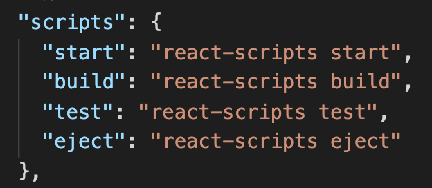

```
start: 打开本地dev服务器,把react 网站托管到这个本地服务器中
build: 上面提到的src文件夹里的内容需要被webpack打包等系列操作(将es6的语法变为es5的js语法)放置到public文件夹里才能被浏览器识别。如果要做网站部署，那么就可以直接把这个build文件夹复制粘贴到服务器上就可以了。
test:test脚本，顾名思义，就是做单元测试unit test用的 (这个说实话，我还不太了解呀)
eject： 可以帮助我们弹出网站的配置文件，我们就可以自定义配置了(慎重使用，因为会造成不可逆的结构性改变，所以要搭配git的版本回退功能来使用) 似乎这个命令可以看到脚手架的webpack的配置
```

4. 非常具有 react 代表性的写法`jsx`。 在 js 文件(也可以放在 jsx 文件)里写类似 html 格式的代码。这就是 react 项目`独有的`文件格式 (关键句：我们整个 react 项目都是放在一个 html 文件(public 文件夹里的)一个 id 叫做 root 的 div(html 元素)中的)
5. 掌握好 webpack，因为 React 项目上线使用的底层打包工具就是 webpack

#### 2-4 NPM vs YARN

(yarn 是否有优势呢？ 老师回答： 没啥优势，npm5 以前确实是 yarn 比较好，但现在这俩工具没啥区别了)
二者都是包管理工具(还是使用 npm 更舒服点)

#### 2-5 tsconfig.json 详解(这里的内容其实涉及了 webpack，所以 webpack 这里要好好学学才行)

1. 搭建基于 ts 的 react 项目 命令行输入: npx create-react-app my-app-ts --template typescript

2. 初始化 ts 的 react 项目后，其实可以发现，基于 ts 的 react 比 基于 js 的 react 项目多了 `tsconfig.json`文件(还少了一个 package-lock.json 文件，这个文件我不知道是用来干啥的)

3. TS 基础补充

- ts 是 js 的超集
- ts 用来给原生 js 添加静态类型检查
- 与 ES6 一样，目前还无法被主流浏览器直接读取

4. TS 的编译(这里又是和 webpack 相关的知识了！)

- ts 需要编译器：常见的编译器有：ts-loader、 awesome-typescript-loader、以及 babel-loader(对于 create-react-app 这个脚手架工具而言，使用的就是 babel-loader 这个编译器，所以 ts 编译器的配置文件就是 tsconfig.json)

5. tsconfig.json 文件解读(这部分内容非常的重要， 还是跟 webpack 配置有关)

- "noImplicitAny": false, // 加上这句话，就不需要显示地显示变量的类型 any
- "target": "es5" // 这是代码被编译后的目标 js 版本，一般来说，我们需要让它编译为 es5，这样就可以被主流浏览器解读了，如果是 react-native 做手机 app，那么这里的选项可以选择 es6(其实除了 es5、es6),我们还有很多其他常见的选项，ES5、ES6、ES7...
- "lib": ["dom", "dom.iterable", "esnext"] // 这个属性列出了编译期间需要被包括进来的库文件，通过这些库文件，告诉 ts 编译器可以使用哪些功能
- "allowJs": true // 允许混合编译 js 文件
- "esModuleInterop": true // 这个选项允许我们使用 commonjs 的方式 import 默认文件。比如，在没有开启这个选项时，需要这样写才能引用 react: `import * as React from 'react'` 但是当我们开启了这个选项以后，import 方式就与普通的 js 没有区别了，可以写为： `import React from 'react'` (其实这条内容，我没怎么看懂)
- "noEmit":true // 开启这个选项表示当发生错误的时候，编译器不会生成 js 代码
- "jsx": "react" // 显而易见，这个选项允许编译器支持编译 react 代码
  ...

#### 2-7 深挖 TS 编译流程

对于我们的项目，首先我们用 create-react-app 脚手架创建了 react 项目，启动了 webpack，然后，webpack 中使用了 babel-loader 来编译 ts 文件；最后，在编译的同时根据 tsconfig.json 来配置编译信息

- 将之前的基于原生 js 的 react 项目变为基于 ts 的 react 项目该如何操作呢

```
1. 在项目的根目录下，安装： npm install --save typescript @types/node @types/react @types/react-dom @types/jest

2. 打开根目录下的src文件夹，把所有js或者jsx结尾的文件后缀通通改为tsx，接着回到命令行，运行npm install 确保依赖安装完成
```

**带着问题来学习**

1. 什么是 React? React 是当前前端最流行的 3 大框架之一，本质上是基于 js 的一个 ui 库
2. React 有什么特点？优势、劣势是什么？ 数据单向流动，jsx 语法，函数式编程，虚拟 dom，组件化。 优势是组件化，便于项目管理，以及特别的 jsx 语法让项目 js 和 html 相结合。 劣势是学习成本较大
3. 什么是 jsx?为什么浏览器无法读取 jsx?
4. 什么是虚拟 dom？
5. 什么是组件？
6. state 和 props 的区别有哪些？
7. React 组件的生命周期有哪些阶段？

#### 3-3 【理解】React 的前世今生

1. 零几年的时候 ajax 以及 jQuery 的出现，可以使 js 动态操作 dom 元素以及解决浏览器的兼容性问题(但是随着项目越来越复杂以及需求越来越多样化，维护成本越来越高，我们不仅要简化代码，更需要设计模式！！ 2010 年，第一代 angularJS 带着 mvc 的设计理念横空出世。又是一次前端的蓬勃发展，但是 angularjs 有个天生缺陷即`数据双向绑定`，因为双向数据绑定，导致网站运行速度越来越慢，同时，mvc 架构也带了了网页状态管理混乱的问题。尽管如此，但第一代的 angularJS 带来了一个网站设计思想即`组件化`(组件化就相当于把每个网页才分成若干独立的`模块`(又是模块，跟 webpack 又扯上关系了) 这就意味着你的网站可以被轻易复制和管理。))顺应着组件化的思想，就诞生了我们今天所熟知的`angular`、`reactjs`、`vuejs`等一系列前端框架(这三大框架都是蕴含了组件化的思维吗？)，以及产生了`flex`、`redux`、`mobx`、`immutable`、`observerable`等一些列状态管理的思想。

2. React 的成功基于 3 个独特的设计理念：

   - 单向数据流
   - 虚拟 DOM
   - 组件化

---

[React 设计中的闪光点](https://zhuanlan.zhihu.com/p/28562066)
**【单向数据流】**
数据与界面绑定是非常重要的，通过数据的变化来动态改变页面的显示，这种方式可以极大的减轻前端开发的压力。 但是如何解决 UI 和数据同步呢？ 第一代的 angularJS 引入了双向数据绑定的概念，数据的变化会改变 ui，但是操作 ui 也会影响数据(出现的问题：整个项目越发臃肿，数据也越来越不可控)。 React 对于数据的处理就更加聪明了，不仅选择单向数据流，也选择了另外一条完全不同的方向：单向渲染 --> React 就像一个没有副作用的函数，忠实地根据数据输入来建立符合预期的 UI (通过数据来展示 ui)

**【虚拟 DOM】**
如果说单向渲染是 React 的内核思想，那么虚拟 DOM 就是能够让这个思想得以实现的关键性技术。 在 JS 和 DOM 之间增加一个新的抽象 ui 层，在真实 UI 需要更新时，react 会对比这两个 ui 层，最终以最小的代价差量更新 ui 的元素

**【组件化】**
组件化，就像是搭积木，每一块积木就是一个组件，及既独立又统一，可以自由组合组件！这样就更有助于保持交互一致性、保持视觉风格的统一、便于程序员相互之间的协作

#### 3-4 【组件化】初识 React 函数式组件

1. React 项目初始化后，几个经典的组件介绍：

> App.tsx 组件(src 文件夹下的)
> 这个文件里的 App 组件是一个函数式组件。现在先通过 ts 来研究一下 App 函数的类型
> 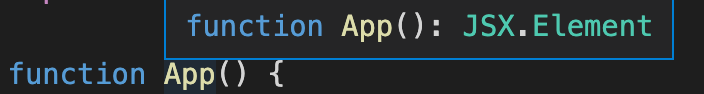
> 可见，返回类型是 JSX 元素(也只能是 JSX，不能是其他类型)。 我们可以得到一个结论**只要返回的是 jsx 对象，那么就是一个合法的 react 组件**

2. 假数据似乎都是取名为 mock， 数据似乎基本上都是以 json 文件的格式来进行存放的(这样是更方便解析吗？)

3. 有一个疑问：如果把 mockData 文件夹放在 src 源文件夹外，src 内的文件如(App.tsx 文件还访问不到，这是怎么一回事呢？)

4. 这里很优秀，项目把需要的组件放在一个专门存储组件的文件夹里(components 文件夹 需放在 src 文件夹下)

5. 在一个文件里写一个最简单的函数式组件
   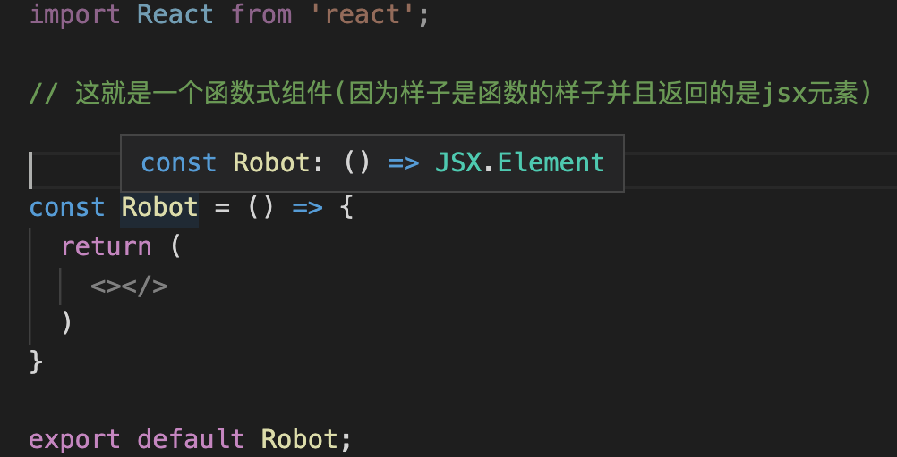
   (值得注意的是，需要返回 jsx 而不是其他类型)

6. props 的概念 即通过 props 来传递组件之间的数据

7. 给函数组件加类型定义 例如 const Robot:React.FC = (props) => ...
   如果没有 React.FC,则需要给 props 加上指定的类型。

   FC = function component 函数式组件

   鼠标指向 React.FC 显示

   ```
   type React.FC<P = {}> = React.    FunctionComponent<P>
   泛型参数P = props   默认为{}(空对象)
   ```

8. 自定义接口，结合 React.FC 来给 props 定义类型

```
// 创建一个接口
interface RobotProps {
  id: string,
  name: string,
  email: string
}
const Robot : React.FC<RobotProps> = (props) =>...
这时候，props的类型自动绑定为 RobotProps。
```

如果不结合 React.FC 则应该用如下方法给 props 定义类型

```
interface RobotProps {
  id: string,
  name: string,
  email: string
}

const Robot = (props: RobotProps) =>...
```

9. 利用 es6 的语法(注意！react 中是允许写 es6 语法的)花括号来展开参数，让代码更简洁...

```
旧：
interface RobotProps {
  id: string,
  name: string,
  email: string
}
const Robot : React.FC<RobotProps> = (props) => {
  return <>
    const id = props.id
  </>
}

新：
interface RobotProps {
  id: string,
  name: string,
  email: string
}
const Robot : React.FC<RobotProps> = ({id, name, email}) => {
  return <>
    id... // 直接使用
  </>
}
```

10. 注意，在 JSX 语法中你可以在`大括号`里放置任何有效的 js 表达式

11. 关于大括号的问题：

```
    <ul>
      {robots.map(robot => {
        // 为什么这里robot.xx也要用{}来包裹呢？
        <Robot id={robot.id} email={robot.email} name={robot.name}/>
      })}
    </ul>
  );

  3-5 第3点有讲解！   用括号是因为插入的是一个js表达式
```

#### 3-5【概念理解】JSX 编程思维

1. JSX 是 ReactJS 自创的语言(既不是 js 也不是 html 或者理解为即是 js 又是 html) 但是 JSX 是具有 JS 的全部功能的

2. 首先要明确一件事情，React 并未强制开发者使用 JSX，程序员可以选择用纯粹的 js 的方法，调用 react 的 api 来实现 react 项目。 但是使用 JSX 可以在视觉上有辅助作用，并且可以显示更多有用的错误或者警告信息。但这些都并不是使用 jsx 的理由。**为啥要使用 JSX？** 在 react 的认识里，ui 视图的本质就是渲染逻辑与 ui 视图表现的内在统一。**将 html 与逻辑想结合(渲染逻辑与 UI 视图的耦合)，这就是 JSX**

3. **【JSX 的特点】**
   (JSX 既能写 html，又能写 js)

   - 常规的 html 代码都可以与 JSX 兼容。比如，html 中的 h1 元素、div 元素、button 元素等
   - 可以在 JSX 中嵌入 JS 表达式(需要被包裹在大括号里面)
   - 使用 JSX 指定子元素？
   - 因为 JSX 语法更接近 js 而不是 html，所以 react 在命名规范上使用驼峰命名(注意：JSX 里的 class 变成 className, 而 tabindex 变为 tabIndex)
   - JSX 也是一个表达式，在编译之后，JSX 表达式会被转为普通 JS 函数调用，并且对其取值后得到 JS 对象，也就是说，你可以再 if 语句和 for 循环的代码块中使用 jsx，将 jsx 赋值给变量，把 jsx 当作参数传入，以及从函数中返回 JSX
   - **JSX 特定属性** 你可以通过使用引号，来将属性值指定为字符串字面量 `const element = <div tabIndex='0'></div>;` 也可以使用大括号，来在属性值中插入一个 JS 表达式： `const element = </img>;`
   - jsx 的自定义属性，以 data-开头 `const element = <div data-customized={'自定义属性'}></div>;`

4. **使用 JSX 指定元素**
   假如一个标签里面没有内容(没有再嵌套标签啥的)，你可以使用 `/>` 来闭合标签，就像 XML 语法一样。
   `const element = ;`
   JSX 标签里能够包含很多子元素：
   ```
    const element = (
      <div>
        <h1>Hello!</h1>
        <h2>Good to see you here.</h2>
      </div>
    );
   ```
5. **JSX 防止注入攻击** 使用花括号直接引用渲染内容的时候，React 会自动转义(但是人家只要输入一个函数，同样会被 xss 注入攻击的)
6. JSX 表示对象
   JSX 会被编译为 React.createElement()对象

```
const element = (
  <h1 className='greeting'>
  Hello, world!
  </h1>
)

const element = React.createElement(
  'h1',
  {className: 'greeting'},
  'Hello, world!'
);
这两种写法的效果是一样的，最后输出的对象如下：
const element = {
  type: 'h1',
  props: {
    className: 'greeting',
    children: 'Hello, world!'
  }
};
```

#### 3-6 【组件化】配置 React 的 css 模组

1. 在 React 中使用 css 文件 可以选择把 css 文件和 component 文件放在同一个目录下。比如： Robot.module.css Robot.tsx

2. React 最大的优势是`组件化`,即每个 jsx 或者 tsx 文件被视为一个独立存在的原件。我们使用一个简简单单的 import 关键词，来 import 整个 css 文件，那么将会直接引入整个文件，而不是`按需加载`。这样的操作可能会在成全局污染。 所以，我们应该把 import 一个 css 文件换成 import 这个 css 对象，通过访问对象来独立加载组件样式

   > import './index.css';
   > import style from './index.css'

3. 注意一个问题！在 ts 的 react 项目中，无法识别 css 格式文件(即 import style ...无法识别) 需要给 css 文件加上类型的定义配置

4. 在 ts 中，类型的定义要用*.d.ts 为后缀的文件表示，*.d.ts 是 ts 专用的声明类型的文件(只包含类型声明，不包含任何逻辑，不会被编译、不会被 webpack 打包)声明方法如下：

```
declare module "*.css" {
	const css: { [key: string]: string };
	export default css;
}
```

5. **【css 文件的引入】**
   有两种方法：
   方法一： 直接引入整个 css 文件

```
import './index.css'
//使用方式
<div className="app"></div>

```

方法二： 利用 CSS in JS，把 css 转化为对象，通过对象的方式，模块化引入组件

```
import styles from "./App.module.css";
//使用方式
<div className={styles.app}></div>

```

从组件化的角度上来说，使用第二种方式`CSS in JS`会更加贴合 React `组件独立`的原则

6. **利用 TS 给 CSS 加上类型**
   实现步骤：

   > 1.安装插件：npm i typescript-plugin-css-modules --save-dev (因为不参与上线，所以放在 dev 依赖中)

   > 2. 打开 tsconfig.json,来注册、启用这个插件： "plugins": [{ "name": "typescript-plugin-css-modules" }]。

> 3. 在根目录下创建.vscode 的文件夹，这个文件夹是用来处理 vs code 配置的，添加文件 settings.json,然后在文件中输入这么一段话

```
{
"typescript.tsdk": "node_modules/typescript/lib",
"typescript.enablePromptUseWorkspaceTsdk": true
}
```

这时候，我们的编译器就可以对 css 也有只能提示功能了

7. 区分 dev 依赖项和普通的依赖：
   dev 依赖(devDependencies)就是指哪些仅参与代码开发，而不参与最终上线打包的项目，比如 typescript、babel-loader 等

#### 3.7 【资源配置】加载媒体与字体文件

1. 注意，create-react-app 这个脚手架已经帮助我们配置好了各种媒体资源的加载工具(其实自己把 webpack 学会后，自己也可以尝试一下弄弄这些)

2. **文件管理：** 一般来说，网站的静态资源我们都会统一保存在同一个文件夹中，这样方便我们进行统一的管理。命名约定一般为`assets`,然后在这个大文件里，分别创建`font`、`imgs`、`icon`文件夹来分别放对应的文件。

```
src
 |-assets
      |- imgs
      |- fonts
      |- icons
```

3. 字体下载
   目前我已知的给 React 项目全局加载字体的方法有两种
   1. 首先在 google font：https://fonts.google.com (需要翻墙)里找到合适的字体:
      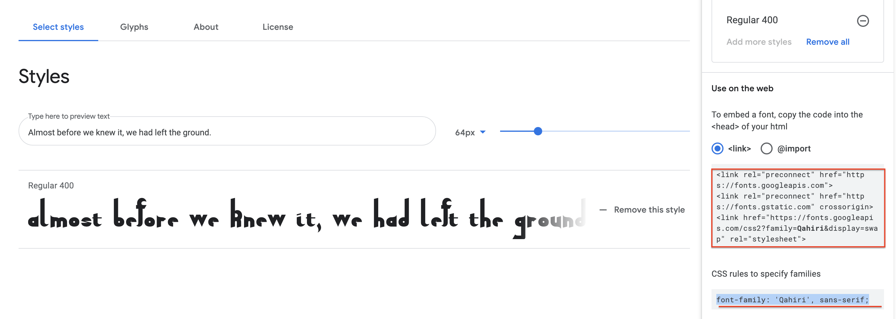 然后把红线勾中的部分放进 public/index.html 里面，就可以实现全局字体的使用了。如图： 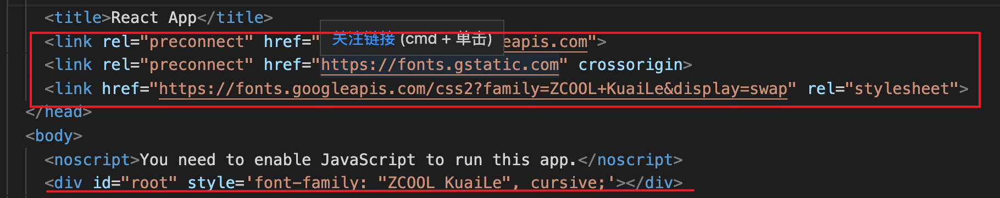 这样就能实现全局注入新的字体的效果了！
   2. 首先在搜索引擎搜索免费字体(随便推荐一个：https://www.fonts.net.cn/fonts-zh-1.html)： 下载之后，会得到一个 ttf 为后缀的字体文件(把这个文件放进 assets/fonts 文件夹里)，在 src/index.css 文件下配置文件。 如下图： 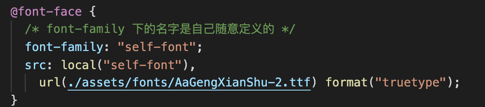。 之后，如果要使用该字体，直接 font-family 定义的名字即可：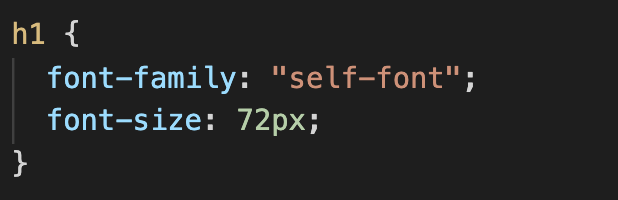

#### 3.9【组件化】创建 class 类组件

1. 注意一个关键点！组件的文件命名，首字母大写

2. 一个 class 组件基本的结构如下图：
   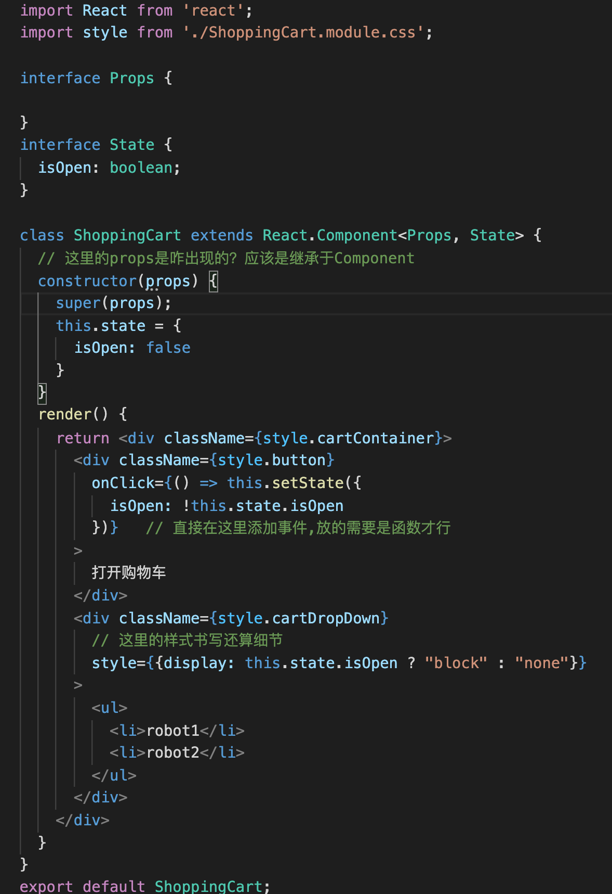

3. 关于 ClassComponent 的一些小知识点需要注意：
   > 1. 类组件首先会通过继承 React 的组件基础类 ReactComponent 来创建类组件
   > 2. React.Component 接受一个范型，而它的范型接受三个参数： 第一个参数`P`，代表`props`; 第二个参数`S`, 代表组件自己的状态`state`，以及最后的参数`SS`，代表自定义数据

#### 3.10 【延伸阅读】React 的行内样式与 CSS

- style(行内样式 inline-style)规范：

  > 一般来说，不推荐使用 style 属性作为设置元素样式的主要方式。多数情况下，应该使用 className 属性来引用外部 CSS 样式中定义的 class。行内样式多用于在渲染过程中添加动态计算的样式(比如引入 css 变量)

- 行内样式用法讲解：
  `style`接受一个采用小驼峰命名属性的 js 对象，而不是 css 字符串(可以预防跨站脚本(XSS)的安全漏洞 这里的内容其实可以看看官网的)。

  ```
    // 这里就是js对象了
    const divStyle = {
      color: 'b',   // 甚至都不是分号，而是逗号
      backgroundImage: 'url(' + imgUrl + ')', // 这里是驼峰命名
    };

    function HelloWorldComponent() {
      return <div style={divStyle}>Hello World!</div>
    }
  ```

  React 会`自动添加"px"`后缀到内联样式为数字的属性后。如需使用"px"以外的单元，请将此值设为数字与所需单位组成的字符串。

  ```
  // Result style: '10px'
  <div style={{ height: 10 }}>
    Hello World!
  </div>

  // Result style: '10%'
  <div style={{ height: '10%' }}>
    Hello World
  </div>
  ```

#### 3-11 【概念理解】State vs Props

(**React 的数据流动方向是单向的，而渲染方式则是以数据驱动的方式单向渲染**)

State 与 Props 区别：
**【state】**
State 是一个组件的 UI 数据模型，是组件渲染时的数据依赖。state 和 props 类似，都是组件所需要的数据，但是`state是私有的`，可以认为 state 是组件的`私有属性`

##### state 正确的打开方式

(有 state 就是 class 组件)

1. 用`setState函数`来修改组件状态 state。 当我们在修改组件状态的时候，直接修改 state，不会触发组件的渲染逻辑，也就是 render 函数，所以页面不会被重新渲染。 正确的修改方式是使用`setState()`函数，比如 这样

```
onClick={() => {
  this.setState({ isOpen: !this.state.isOpen})
}}
```

在 setState 函数中以对象赋值的方式来更新状态。当我们调用 setState()以后，react 会更新组件的状态，并重新调用 render 方法来渲染页面。 请注意，构建函数`constructor`是唯一可以初始化 state 的地方。一旦离开构建函数，那就只能通过 setState 函数来更改组件状态了

2. State 的更新是`异步`的
   调用 setState 后，组件的状态 state 并不会立刻改变，React 会优化真正的执行时机，在优化过程中有可能会将多个 setState 的状态修改合并为一次状态修改，因而 state 更新可能是异步的

**【props】**
从本质上，组件就是一个函数，而 props 就是传入函数的参数，所以我们可以把 props 理解为从组件外部传入组件内部的数据。因为 react 的数据是单向流动的，所以 props 也就是从父组件传递向子组件的数据

##### props 与 immutable

immutable，对应中文就是不变的，核心思想就是对象一旦建立就`只能读取，不可改变`,如果要改变数据，那么就要销毁这个对象，同时按照新数据创建一个全新的数据。这样，我们就可以简单的通过判断内存地址是否一致的方式来判断对象是否有过修改，这样可以极大的提高系统的效率。这种思想被广泛的用于很多前端框架中，比如`Immutable.js`、`redux`、`observable(RxJS)`等 `props`只能被用作组件渲染和组件初始化，在组件内部是无法改变 props 的，所以 props 是只读属性的，也就是 immutable

#### 3-12 【事件驱动】React Event 事件处理

在类中使用函数，以及使用属性的道理

**这一小节有几个知识亮点**

1. **this 绑定的问题**。两种方法解决。一、在 constructor 里面使用 bind()进行 this 绑定 二、利用箭头函数进行 this 的绑定 (推荐使用箭头函数)

2. **icon 组件**

   > [icon 组件](https://react-icons.github.io/react-icons) 这里面提供了 icon 组件的安装方法以及各种各样的 icon(符合 React 组件化思维，使用非常方便！)

3. **获取事件 e 的类型方法**: 利用好箭头函数，通过鼠标移动到参数 e 上获得 e 的类型。如下图所示 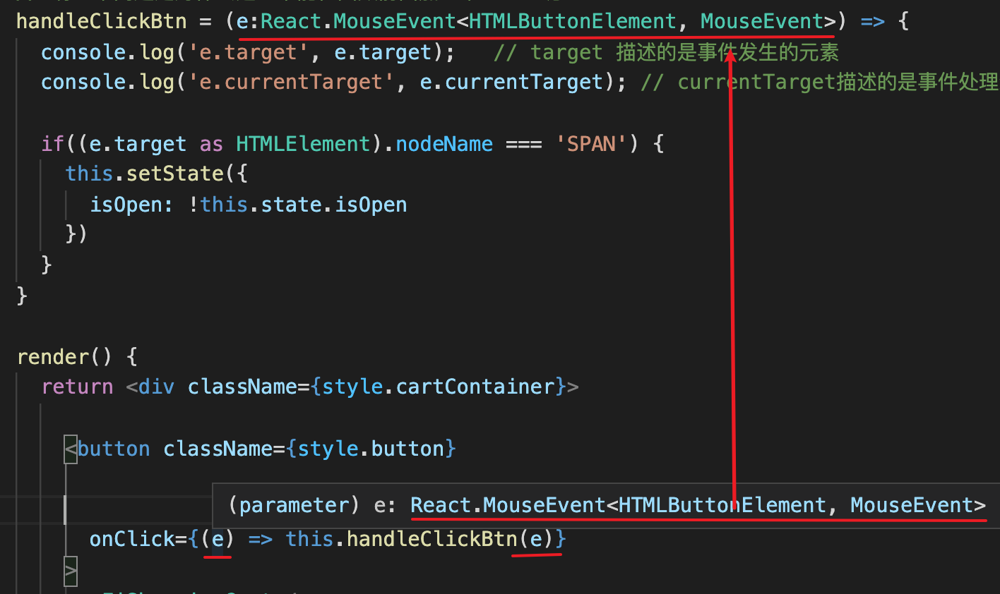

4. **e.target 和 e.currentTarget 二者区别**
   `target 描述的是事件发生的元素，而currentTarget描述的是事件处理绑定的元素`
   更形象的展示这两个属性的区别：由下列三张图来显示
   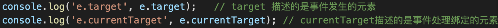
   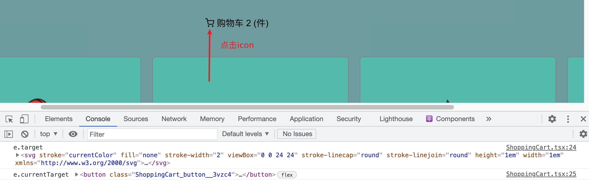
   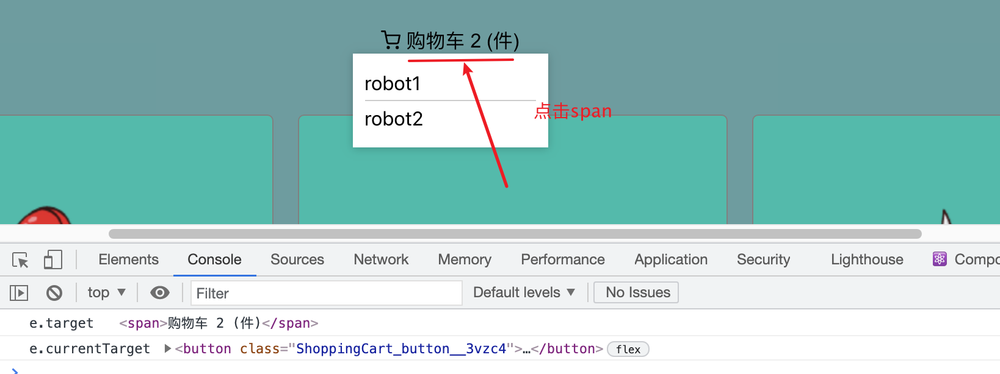

   e.currentTarget 永远指向 button 本身，而 e.target 根据你点击的元素来确定

##### 几个思考点

1. class 组件中为什么声明的函数左边不加 let const var ? 实质不仅仅是 class 组件会这样，js 的 class 也是这样，建议可以去看看[廖雪峰讲 class](https://www.liaoxuefeng.com/wiki/1022910821149312/1072866346339712)

2. 为什么在 class 组件内部使用函数也是要用 this 呢？ this 调用 class 里的属性(函数也相当于一个属性，具体的内容可以看看 js 的知识)

#### 3-13 【异步处理】获取网络 API 数据

**这节有几个知识亮点**

1. 异步获取 API 数据使用 Promise(这个知识是很重要的，幸好我已经明悟，并且还有专门的文章) 结合 fetch 来获取数据。 fetch 需注意，返回的是 Promise 对象，以及.json()方法。更多的细节可以去`MDN`等资料上去了解
   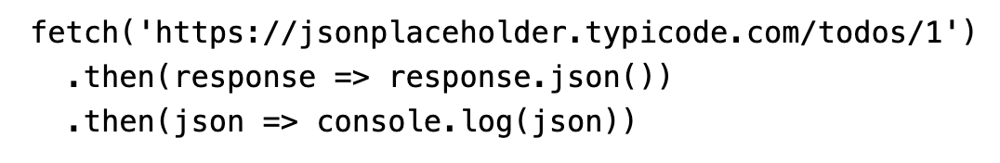

2. 有一个挺有意思的网站 专门为前端开发提供[api 假数据](https://jsonplaceholder.typicode.com) 这个网站挺好的！！！值得用起来

3. 将函数组件转变为类组件方法(只需要三个步骤)

   - 第一步，把 function 改为 class，然后去掉括号，让组件去继承 React.Component。(范型从原来只有一个 Props 参数变为 Props 和 State)

   - 第二步，构建 constructor 和在构造函数里定义 state 数据

   - 第三步，把之前 return 的 jsx 类型放进 render(){} 函数里

4. 这一节的内容里，我把 robotGallery 定义为 any 类型的数组

```
interface State {
  robotGallery: any[]
}
```

事实上，尽管 ts 是进行类型定义的语法，但是并非所有的类型都必须有完整的定义。首先，对于 robotGallery 来说，资源是来源于网络 api 请求的，而返回的数据类型不受我们的控制，强行限定 api 的返回数据类型，说不定几天后，会有新的数据变化，在现在的网站开发中，前后端分离越来越成为主流，对 API 的返回数据类型进行尅性定义，等于是在强行绑定前后端，那么前后端分离就还有什么意义呢？ 然后，ts 只是对于 js 类型的补充，但绝对不是标准，js 具备特殊的语言灵活性，而 ts 的出现是在基于灵活性的基础上做一定的类型补充而已。所以一定不能为了使用 ts 而放弃了 js 原本的优势

#### 3.13【异步处理】setState 的异步开发

**一道 React 面试常见题**

```
setState函数式异步还是同步？
```

**【演示】**
通过鼠标点击计数器来演示 setState 的处理机制

```
<button
	onClick={() => {
		this.setState({ count: this.state.count + 1 });
		console.log("count ", this.state.count);
	}}
>
	click
</button>
```

```
<span>count: {this.state.count}</span>
```

在网站上点击计数器。可以看见，点击页面，实时数字+1，但是 conso 却是从 0 开始
事实上：`setState函数是异步处理state变化的`
setState 函数的第二个参数，可以放一个函数，这个函数的内容可以与页面显示的数据同步。`异步更新、同步执行`。 事实上，setState 函数本身不是异步的，但是它对 state 的处理机制给人一种异步的假象
... 这一节的内容，好像只能从代码里看出区别，但是从概念上，不太好理解这个意思！

推荐一篇感觉还不错的文章：
[博客园](https://www.cnblogs.com/monkeySoft/p/13283558.html)

---

### 穿插双越老师关于 React 的知识原理内容。 挺重要的！！

针对`setState`问题，双越面试"笔记"如下
(注意！下面的内容其实只是讲了现象而非原理，React 原理太深奥，钻进去可能就出不来了...)
`setState`

- 不可变值 (必须的，React 中 setState 必须使用不可变值)
- 可能是异步更新 (注意 可能是，可能会)
- 可能会被合并

##### setState 为何使用不可变值

在类组件中 直接进行例如`this.state.count++`这种直接修改 state 的操作是错误的

---

注意一些细节问题：

1. 使用 setState 之前不能提前把 state 的值进行修改后，再把值放进 setState 里面。例如下面的例子！

```
// 错误的操作！
this.state.count++;
this.setState({
  count: this.state.count;
})
```

2. 使用 setState 修改 state 的内容的时候，要保持不可变值的思想(即变更的数据是被创建的副本，对本身是没有任何变化的)，如下面的例子：

```
this.setState({
  count: this.state.count++;   // 错误，没有体现出不可变值，不是副本的数据在发生变化
})

this.setState({
  count: this.state.count + 1;  // 正确，体现出了不可变值的逻辑
})
```

上面我展示的不可变值是普通的类型，下面我用数组、对象再来展示一下不可变值的魅力

```
// 不可变值 - 数组
const list5Copy = this.state.list5.slice()
list5Copy.splice(2, 0, 'a')   // 中间插入/删除
this.setState({
  list1: this.state.list1.concat(100),  // 追加
  list2: [...this.state.list2, 100],    // 追加
  list3: this.state.list3.slice(0, 3),  // 截取
  list4: this.state.list4.filter(item => item > 100), // 筛选
  list5: list5Copy
})

// 注意，不能直接对this.state.list 进行 push pop splice等操作，这样违反不可变值

// 不可变值 - 对象
this.setState({
  obj1: Object.assign({}, this.state.obj1, {a: 100}),
  obj2: {...this.state.obj2, a: 100}
})
(补充一些小知识： Object.assign 就是浅拷贝，总之，如果想要使用深拷贝，就自己写或者使用lodash的deepClone)
// 注意，不能直接对 this.state.obj 进行属性设置，这样违反不可变值
```

##### setState 是同步还是异步

先来一个小例子：

```
this.setState({
  count: this.state.count + 1;
})

console.log('count', this.state.count);  // 异步的，拿不到最新值(而是拿的当前的state的值，不是渲染完之后的值)
```

想拿到最新的值,利用好 setState 的第二个参数

```
this.setState({
  count: this.state.count + 1;
}, () => {
  console.log('count by callback', this.state.count);  // 同步的，拿到的是最新值
})

console.log('count', this.state.count);  // 还是异步的
```

在 setTimeout 中 setState 是同步的

```
setTimeout(() => {
  this.setState({
    count: this.state.count + 1;
  })
  console.log('count in setTimeout', this.state.count)
}, 0)
```

**在 componentDidMount**中，自己定义的 DOM 事件，setState 是同步的

```
componentDidMount() {
  // 自己定义的DOM事件，setState是同步的 (妈的，竟然可以自己来定义这个DOM事件)
  document.body.addEventListener('click', () => {
    this.setState({
      count: this.state.count + 1
    })
    console.log('count in body event', this.state.count)
  })
}

componentWillUnmount() {
  // 注意！要及时销毁自定义DOM事件，以及定时器
  document.body.removeEventListener('click', this.bodyClickHandler)
  // clearTimeout
}
```

##### setState 合适会合并 state

**state 异步更新的话，更新前会被合并**

```
// 这里的合并是React的底层操作吗？
// 传入对象，会被合并(类似 Object.assign)。执行结果只一次 +1 (感觉还是没怎么理解... 只能先记住现象了)
this.setState({
  count: this.state.count + 1
})
this.setState({
  count: this.state.count + 1
})
this.setState({
  count: this.state.count + 1
})

// 传入函数，不会被合并(函数是没法合并的！)，执行结果是 +3
this.setState((prevState, props) => {
  return {
    count: prevState.count + 1
  }
})
this.setState((prevState, props) => {
  return {
    count: prevState.count + 1
  }
})
this.setState((prevState, props) => {
  return {
    count: prevState.count + 1
  }
})
```

#### 3-15 【死与新生】探索 React 组件的生命周期

React 组件的**生命周期由生到死**可分为**三个阶段**

- Mounting: 创建虚拟 DOM 元素，渲染 ui -- 是组件第一次绘制阶段，在这里完成了组件的加载和初始化
- Updating: 更新虚拟 DOM 元素，重新渲染 ui -- 是组件在运行和交互阶段，这个阶段组件可以处理用户交互或者接收事件更新界面
- Unmounting: 删除虚拟 DOM 元素，移除 ui -- 是组件卸载消亡的阶段，这里做一些组件的清理工作

##### 更细节的步骤：

**【构建函数】**
首先是构建函数，`constructor`。主要用于初始化组件 state

##### 【初始化】

接下来，是生命周期第一阶段。 这个阶段，主要有两个函数， 第一个是构建函数，用于处理组件 state 的初始化；第二个是`componentDidMount()`。这个组件`只会在初始化`的时候`被调用一次`，将会在组件创建好 dom 元素以后、挂载进页面的时候调用。

##### 【更新】

这是生命周期第二个阶段，组件的更新阶段。需要了解 4 个内置函数

**componentWillReceiveProps**
当组件的 props 发生改变的时候，这个函数就会被调用，但是这个函数会产生无法预测的副作用，有时候会发生很多匪夷所思的事情。所以，目前这个函数已经被废止了，`请避免使用`

**static getDerivedStateFromProps**
如果非用不可，那么请使用另外一个替代函数。这个函数式一个静态函数，函数名称，`static getDerivedStateFromProps`,接受两个参数，nextProps 和 prevState，它在组件初始化以及组件更新的时候都会被调用，作用就是用来对比当前 props 和之前 props 的变化

**shouldComponentUpdate**
在更新阶段，第二个值得我们留意的函数是`shouldComponentUpdate`(重要)，同样接受两个参数，nextProps 和 prevState,不过这个函数的作用是通过判断 props 和 state 的变化来控制组件是否需要被更新。一般来说，如果我们要使用这个函数，那么只要 props**或**state 有任何变化，组件都会被更新，UI 也会被重新渲染。但这样每次都渲染 ui 会带来很大的资源开销，所以要懂得性能优化。

**componentDidUpdate**
只要组件更新，ui 重新渲染，那么这个函数就会被调用

##### 【消亡】

需注意一个函数，`componentWillUnmount(){}`, 这个函数会在组件销毁的时候被调用，我们可以把他当作析构函数 destructor 来使用。通过这个函数，我们可以回收各种监听以及时间，用来避免组件销毁时的内存泄露

来一幅比较直观的图：
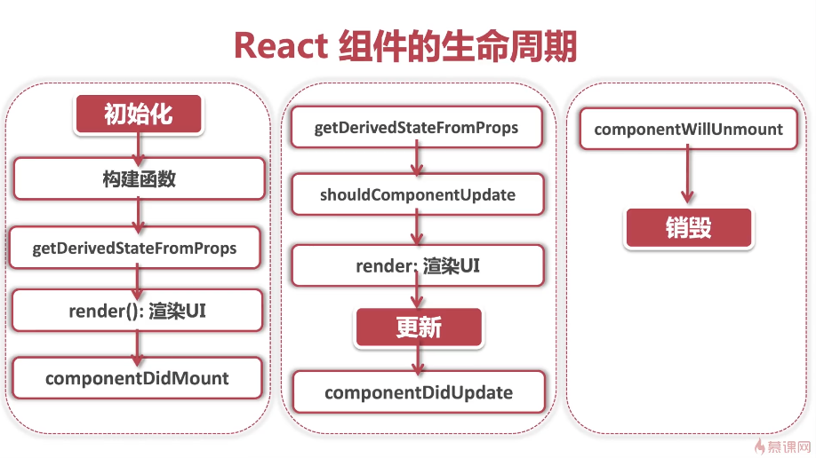

**双越 React 面试 之 生命周期**
有一个比较好的显示生命周期的[网站](https://projects.wojtekmaj.pl/react-lifecycle-methods-diagram/)

#### 7-13【概念理解】React 17 版本变化

**React 17**

- 虽然没有新功能，但具有战略意义
- 替换了底层的代码，向下兼容、同时甩掉了历史包袱
- 没有代码断层，给未来留下了足够的升级空间

**React 17 具有逐步升级的能力**

- 逐步升级的方案，允许多个 react 版本共存
- 先升级路由系统、再升级弹窗，平滑的过渡到最新版本
- 事件委托机制改变
- 向原生浏览器靠拢
- 删除事件池(事件池这东西根本就不常用)
- useEffect 清理操作改为异步操作
- JSX 不可返回 undefined
- 删除部分私有 API(删除的大部分是 React Native 里的 API，所以对于前端的影响并不大)
- React 17 并不是过渡版本，而是承上启下的战略版本
- 未来将会更加强调函数式组件
- 未来可能会支持微前端架构

#### 4-1 带着问题来学习

1. 什么 Hooks？
2. 什么是纯函数？
3. 什么是副作用？
4. 有状态和无状态组件的区别？
5. 如果跨组件传递数据？
6. HOC 是什么意思？

#### 4-2【概念理解】什么是钩子(hooks)

Hooks 是 2018 年`React 16.7`推出的还算比较新的特性。 让我们能够在不适用类组件的情况下使用组件状态 state 和其他 react 相关操作。
React Hooks 利用钩子的理念，让组件尽量写成纯函数而不是类。

**【常用钩子】**
React 提供了一些常用的钩子，例如`useState`、`useEffect`、`useContext`、`useReducer`、`useRef`等。根据 React 的约定，hooks 一律使用 use 前缀命名 useXxx

> 从本质上来说，Hooks 就是一类`特殊的函数`，它们可以为你的函数式组件注入特殊的功能。React hooks 的目标就是让你不再写 class，让 function 来统一江湖(React 就是想完全迈入函数式编程之中)

##### React 为什么要创造 Hooks 这个概念呢？

因为 React 的核心思想其实就是组件化。组件化带来的最大的好处就是，组件之间彼此独立、可以复用。但是，由于组件自身可能会包含各种特殊的状态，所以在大型的 React 项目中，很多 React 组件会变得冗长而且复杂，尤其是与 redux 全局状态连接以后，就不可复用了(失去了组件化的最大意义！)。在推出 hooks 之前，只有两个解决方法：

1. 无状态组件；
2. 使用 HOC 高阶组件

**无状态组件**
无状态组件其实比较容易理解。就是指的一个函数式组件本身是没有 state、没有状态的，当组件没有状态的时候，就是一个纯函数，会变得非常简单，所有的页面显示都依赖于 props 数据的注入，易管理易复用。但是要知道没状态会带来一些致命的问题，就是没有生命周期、没有副作用(就无法进行 api 的访问，以及异步数据的获取，这 ™ 就是直接宣告无法与后端进行交流)

**HOC 高阶组件**
HOC 高阶组件则走了另一个极端，它不管你原先的组件有多复杂，仍要在组件外再嵌套一层组件，通过组件嵌套的方式来达到组件复用的目的，但让代码更复杂了，直接成套娃了！

##### Hooks 带来的好处

hooks 就是直接给函数式组件加上状态。并且用极其简洁的钩子(hooks)来代替过去复杂的 state、生命周期函数。让函数式组件在完成相同任务的情况下更加的`轻量化`，可读性更强。并且远离了坑爹的 this、bind 的操作...还面向了函数式编程完成了 React 的心愿...

##### 【常见的 hooks】

**State Hooks: useState()**
useState 是 React 自带的一个 hook 函数，它的作用就是用来声明组件状态(直接代替原来的 state，setState 操作)，useState 这个函数接收的参数是我们状态初始值，它返回的是一个只有两个元素的数组，这个数组的第一个元素是组件状态，第二个元素就是组件状态的更新函数

**Effect Hooks:useEffect()**

我们写的有状态组件(类组件)，通常会产生比较多的副作用，比如发起 ajax 请求，添加或取消事件，修改 dom 等操作，我们之前是把这些副作用的函数写在组件的生命周期里，比如`componentDidMount`、`componentDidUpdate`和`componentWillUnmount`。而现在的 useEffect 就相当于这三个生命周期函数的集合体，达到以一抵三的效果

**其他钩子函数 先略**
