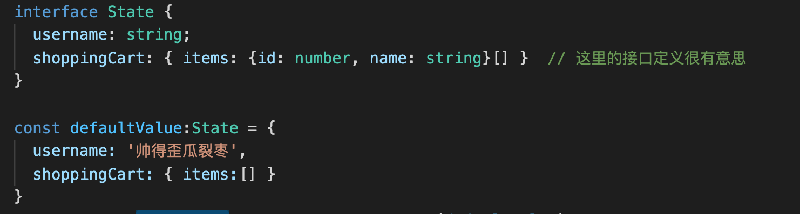
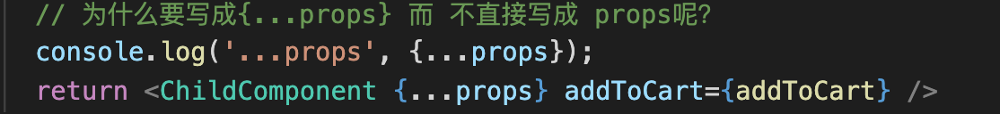

深入去思考、对比！这已经是多次看这个视频了

这次把 git 用好

#### 课程四个阶段(对于我的一个新的要求):

1. 第一阶段 用来回顾一下 react 的基础知识(结合 React 文档)，配合 TS 完成一个实验性网站
2. 实现一个标准电商的所需要的基础功能，比如，页面布局、项目架构、路由配置、数据调取、产品浏览等
3. 项目的架构思想、使用 redux 对项目重构、网站的全局状态管理、用户登录、购物车管理、下单结算功能 以及 react 高级用法
4. 前端项目的测试，使用 docker 来完成 react 项目的容器化部署，并使用阿里云完成项目的上线(使用 Docker 是一个项目亮点 需扩展来学习思考)

**带着问题来学习：**

1. **如何启动一个 react 项目？** npx create-react-app my-app
2. **如何启动一个 TS 版本的 React 项目？** npx create-react-app my-app --template typescript
3. **create-react-app 是什么？** 一个 react 的脚手架, 内置了 webpack
4. **npm 与 yarn 的区别是什么？** (有点意思，上次我遇见了这个问题，但没法完全想出来) 不同的包管理工具
5. **tsconfig.json 有什么用？** 关于 ts 的配置文件？
6. **如何配置 TS 编译器？**

#### 2-2 配置 React 开发环境

> 1. 啥是 npx？
>    [阮一峰老师的博文](https://www.ruanyifeng.com/blog/2019/02/npx.html)
>    npm 从 5.2 版开始，增加了 npx 命令
>    （Node 自带 npm 模块，所以可以直接使用 npx 命令。万一不能用，就要手动安装一下。）
>    npx 对标本地安装项目(并非全局安装) 实现多版本控制
>    npx 想要解决的主要问题，就是调用项目内部安装的模块
>    npx 会自动查找当前依赖包(node_modules)中的可执行文件，如果找不到，就会去 PATH 里找
>    npx 的原理很简单，就是运行的时候，会到 node_modules/.bin 路径和环境变量$PATH 里面，检查命令是否存在。
>    npx 还可以避免全局安装模块 npx 将 create-react-app 下载到一个临时目录，使用以后再删除。所以，以后再次执行上面的命令，会重新下载 create-react-app。(远古时期，首先使用命令行 npm i -g create-react-app 把工具全局安装在你电脑里 然后通过 create-react-app my-app 来创建 react 项目)

> 2. 无论是 npm start 自动打开页面，还是实时刷新页面 其实估计他们在本质上都是通过 webpack 来实现的

#### 2-3 使用 create-react-app 快速搭建 React

1. package.json 里面的 `dependencies`属性。 这是我们的项目依赖，会展示我们在此项目中安装的所有第三方的组件。 可以看到在创建 react 项目的时候，有三个组件非常显眼： react、react-dom、react-script(这三个组件对应发挥的作用有待思考)
2. 两个重点文件夹
   `public` 文件夹：存放的是静态文件(例如 ico、html 页面、png 图片、json 文件、txt 文件)
   `src` 文件夹：存放的源代码，包含基于 es6 规则的`react代码`(这些浏览器是无法直接识别的，需被转化)
   ``
3. 

```
start: 打开本地dev服务器,把react 网站托管到这个本地服务器中
build: 上面提到的src文件夹里的内容需要被webpack打包等系列操作(将es6的语法变为es5的js语法)放置到public文件夹里才能被浏览器识别。如果要做网站部署，那么就可以直接把这个build文件夹复制粘贴到服务器上就可以了。
test:test脚本，顾名思义，就是做单元测试unit test用的 (这个说实话，我还不太了解呀)
eject： 可以帮助我们弹出网站的配置文件，我们就可以自定义配置了(慎重使用，因为会造成不可逆的结构性改变，所以要搭配git的版本回退功能来使用) 似乎这个命令可以看到脚手架的webpack的配置
```

4. 非常具有 react 代表性的写法`jsx`。 在 js 文件(也可以放在 jsx 文件)里写类似 html 格式的代码。这就是 react 项目`独有的`文件格式 (关键句：我们整个 react 项目都是放在一个 html 文件(public 文件夹里的)一个 id 叫做 root 的 div(html 元素)中的)
5. 掌握好 webpack，因为 React 项目上线使用的底层打包工具就是 webpack

#### 2-4 NPM vs YARN

(yarn 是否有优势呢？ 老师回答： 没啥优势，npm5 以前确实是 yarn 比较好，但现在这俩工具没啥区别了)
二者都是包管理工具(还是使用 npm 更舒服点)

#### 2-5 tsconfig.json 详解(这里的内容其实涉及了 webpack，所以 webpack 这里要好好学学才行)

1. 搭建基于 ts 的 react 项目 命令行输入: npx create-react-app my-app-ts --template typescript

2. 初始化 ts 的 react 项目后，其实可以发现，基于 ts 的 react 比 基于 js 的 react 项目多了 `tsconfig.json`文件(还少了一个 package-lock.json 文件，这个文件我不知道是用来干啥的)

3. TS 基础补充

- ts 是 js 的超集
- ts 用来给原生 js 添加静态类型检查
- 与 ES6 一样，目前还无法被主流浏览器直接读取

4. TS 的编译(这里又是和 webpack 相关的知识了！)

- ts 需要编译器：常见的编译器有：ts-loader、 awesome-typescript-loader、以及 babel-loader(对于 create-react-app 这个脚手架工具而言，使用的就是 babel-loader 这个编译器，所以 ts 编译器的配置文件就是 tsconfig.json)

5. tsconfig.json 文件解读(这部分内容非常的重要， 还是跟 webpack 配置有关)

- "noImplicitAny": false, // 加上这句话，就不需要显示地显示变量的类型 any
- "target": "es5" // 这是代码被编译后的目标 js 版本，一般来说，我们需要让它编译为 es5，这样就可以被主流浏览器解读了，如果是 react-native 做手机 app，那么这里的选项可以选择 es6(其实除了 es5、es6),我们还有很多其他常见的选项，ES5、ES6、ES7...
- "lib": ["dom", "dom.iterable", "esnext"] // 这个属性列出了编译期间需要被包括进来的库文件，通过这些库文件，告诉 ts 编译器可以使用哪些功能
- "allowJs": true // 允许混合编译 js 文件
- "esModuleInterop": true // 这个选项允许我们使用 commonjs 的方式 import 默认文件。比如，在没有开启这个选项时，需要这样写才能引用 react: `import * as React from 'react'` 但是当我们开启了这个选项以后，import 方式就与普通的 js 没有区别了，可以写为： `import React from 'react'` (其实这条内容，我没怎么看懂)
- "noEmit":true // 开启这个选项表示当发生错误的时候，编译器不会生成 js 代码
- "jsx": "react" // 显而易见，这个选项允许编译器支持编译 react 代码
  ...

#### 2-7 深挖 TS 编译流程

对于我们的项目，首先我们用 create-react-app 脚手架创建了 react 项目，启动了 webpack，然后，webpack 中使用了 babel-loader 来编译 ts 文件；最后，在编译的同时根据 tsconfig.json 来配置编译信息

- 将之前的基于原生 js 的 react 项目变为基于 ts 的 react 项目该如何操作呢

```
1. 在项目的根目录下，安装： npm install --save typescript @types/node @types/react @types/react-dom @types/jest

2. 打开根目录下的src文件夹，把所有js或者jsx结尾的文件后缀通通改为tsx，接着回到命令行，运行npm install 确保依赖安装完成
```

**带着问题来学习**

1. 什么是 React? React 是当前前端最流行的 3 大框架之一，本质上是基于 js 的一个 ui 库
2. React 有什么特点？优势、劣势是什么？ 数据单向流动，jsx 语法，函数式编程，虚拟 dom，组件化。 优势是组件化，便于项目管理，以及特别的 jsx 语法让项目 js 和 html 相结合。 劣势是学习成本较大
3. 什么是 jsx?为什么浏览器无法读取 jsx?
4. 什么是虚拟 dom？
5. 什么是组件？
6. state 和 props 的区别有哪些？
7. React 组件的生命周期有哪些阶段？

#### 3-3 【理解】React 的前世今生

1. 零几年的时候 ajax 以及 jQuery 的出现，可以使 js 动态操作 dom 元素以及解决浏览器的兼容性问题(但是随着项目越来越复杂以及需求越来越多样化，维护成本越来越高，我们不仅要简化代码，更需要设计模式！！ 2010 年，第一代 angularJS 带着 mvc 的设计理念横空出世。又是一次前端的蓬勃发展，但是 angularjs 有个天生缺陷即`数据双向绑定`，因为双向数据绑定，导致网站运行速度越来越慢，同时，mvc 架构也带了了网页状态管理混乱的问题。尽管如此，但第一代的 angularJS 带来了一个网站设计思想即`组件化`(组件化就相当于把每个网页才分成若干独立的`模块`(又是模块，跟 webpack 又扯上关系了) 这就意味着你的网站可以被轻易复制和管理。))顺应着组件化的思想，就诞生了我们今天所熟知的`angular`、`reactjs`、`vuejs`等一系列前端框架(这三大框架都是蕴含了组件化的思维吗？)，以及产生了`flex`、`redux`、`mobx`、`immutable`、`observerable`等一些列状态管理的思想。

2. React 的成功基于 3 个独特的设计理念：

   - 单向数据流
   - 虚拟 DOM
   - 组件化

---

[React 设计中的闪光点](https://zhuanlan.zhihu.com/p/28562066)
**【单向数据流】**
数据与界面绑定是非常重要的，通过数据的变化来动态改变页面的显示，这种方式可以极大的减轻前端开发的压力。 但是如何解决 UI 和数据同步呢？ 第一代的 angularJS 引入了双向数据绑定的概念，数据的变化会改变 ui，但是操作 ui 也会影响数据(出现的问题：整个项目越发臃肿，数据也越来越不可控)。 React 对于数据的处理就更加聪明了，不仅选择单向数据流，也选择了另外一条完全不同的方向：单向渲染 --> React 就像一个没有副作用的函数，忠实地根据数据输入来建立符合预期的 UI (通过数据来展示 ui)

**【虚拟 DOM】**
如果说单向渲染是 React 的内核思想，那么虚拟 DOM 就是能够让这个思想得以实现的关键性技术。 在 JS 和 DOM 之间增加一个新的抽象 ui 层，在真实 UI 需要更新时，react 会对比这两个 ui 层，最终以最小的代价差量更新 ui 的元素

**【组件化】**
组件化，就像是搭积木，每一块积木就是一个组件，及既独立又统一，可以自由组合组件！这样就更有助于保持交互一致性、保持视觉风格的统一、便于程序员相互之间的协作

#### 3-4 【组件化】初识 React 函数式组件

1. React 项目初始化后，几个经典的组件介绍：

> App.tsx 组件(src 文件夹下的)
> 这个文件里的 App 组件是一个函数式组件。现在先通过 ts 来研究一下 App 函数的类型
> 
> 可见，返回类型是 JSX 元素(也只能是 JSX，不能是其他类型)。 我们可以得到一个结论**只要返回的是 jsx 对象，那么就是一个合法的 react 组件**

2. 假数据似乎都是取名为 mock， 数据似乎基本上都是以 json 文件的格式来进行存放的(这样是更方便解析吗？)

3. 有一个疑问：如果把 mockData 文件夹放在 src 源文件夹外，src 内的文件如(App.tsx 文件还访问不到，这是怎么一回事呢？)

4. 这里很优秀，项目把需要的组件放在一个专门存储组件的文件夹里(components 文件夹 需放在 src 文件夹下)

5. 在一个文件里写一个最简单的函数式组件
   
   (值得注意的是，需要返回 jsx 而不是其他类型)

6. props 的概念 即通过 props 来传递组件之间的数据

7. 给函数组件加类型定义 例如 const Robot:React.FC = (props) => ...
   如果没有 React.FC,则需要给 props 加上指定的类型。

   FC = function component 函数式组件

   鼠标指向 React.FC 显示

   ```
   type React.FC<P = {}> = React.    FunctionComponent<P>
   泛型参数P = props   默认为{}(空对象)
   ```

8. 自定义接口，结合 React.FC 来给 props 定义类型

```
// 创建一个接口
interface RobotProps {
  id: string,
  name: string,
  email: string
}
const Robot : React.FC<RobotProps> = (props) =>...
这时候，props的类型自动绑定为 RobotProps。
```

如果不结合 React.FC 则应该用如下方法给 props 定义类型

```
interface RobotProps {
  id: string,
  name: string,
  email: string
}

const Robot = (props: RobotProps) =>...
```

9. 利用 es6 的语法(注意！react 中是允许写 es6 语法的)花括号来展开参数，让代码更简洁...

```
旧：
interface RobotProps {
  id: string,
  name: string,
  email: string
}
const Robot : React.FC<RobotProps> = (props) => {
  return <>
    const id = props.id
  </>
}

新：
interface RobotProps {
  id: string,
  name: string,
  email: string
}
const Robot : React.FC<RobotProps> = ({id, name, email}) => {
  return <>
    id... // 直接使用
  </>
}
```

10. 注意，在 JSX 语法中你可以在`大括号`里放置任何有效的 js 表达式

11. 关于大括号的问题：

```
    <ul>
      {robots.map(robot => {
        // 为什么这里robot.xx也要用{}来包裹呢？
        <Robot id={robot.id} email={robot.email} name={robot.name}/>
      })}
    </ul>
  );

  3-5 第3点有讲解！   用括号是因为插入的是一个js表达式
```

#### 3-5【概念理解】JSX 编程思维

1. JSX 是 ReactJS 自创的语言(既不是 js 也不是 html 或者理解为即是 js 又是 html) 但是 JSX 是具有 JS 的全部功能的

2. 首先要明确一件事情，React 并未强制开发者使用 JSX，程序员可以选择用纯粹的 js 的方法，调用 react 的 api 来实现 react 项目。 但是使用 JSX 可以在视觉上有辅助作用，并且可以显示更多有用的错误或者警告信息。但这些都并不是使用 jsx 的理由。**为啥要使用 JSX？** 在 react 的认识里，ui 视图的本质就是渲染逻辑与 ui 视图表现的内在统一。**将 html 与逻辑想结合(渲染逻辑与 UI 视图的耦合)，这就是 JSX**

3. **【JSX 的特点】**
   (JSX 既能写 html，又能写 js)

   - 常规的 html 代码都可以与 JSX 兼容。比如，html 中的 h1 元素、div 元素、button 元素等
   - 可以在 JSX 中嵌入 JS 表达式(需要被包裹在大括号里面)
   - 使用 JSX 指定子元素？
   - 因为 JSX 语法更接近 js 而不是 html，所以 react 在命名规范上使用驼峰命名(注意：JSX 里的 class 变成 className, 而 tabindex 变为 tabIndex)
   - JSX 也是一个表达式，在编译之后，JSX 表达式会被转为普通 JS 函数调用，并且对其取值后得到 JS 对象，也就是说，你可以再 if 语句和 for 循环的代码块中使用 jsx，将 jsx 赋值给变量，把 jsx 当作参数传入，以及从函数中返回 JSX
   - **JSX 特定属性** 你可以通过使用引号，来将属性值指定为字符串字面量 `const element = <div tabIndex='0'></div>;` 也可以使用大括号，来在属性值中插入一个 JS 表达式： `const element = </img>;`
   - jsx 的自定义属性，以 data-开头 `const element = <div data-customized={'自定义属性'}></div>;`

4. **使用 JSX 指定元素**
   假如一个标签里面没有内容(没有再嵌套标签啥的)，你可以使用 `/>` 来闭合标签，就像 XML 语法一样。
   `const element = ;`
   JSX 标签里能够包含很多子元素：
   ```
    const element = (
      <div>
        <h1>Hello!</h1>
        <h2>Good to see you here.</h2>
      </div>
    );
   ```
5. **JSX 防止注入攻击** 使用花括号直接引用渲染内容的时候，React 会自动转义(但是人家只要输入一个函数，同样会被 xss 注入攻击的)
6. JSX 表示对象
   JSX 会被编译为 React.createElement()对象

```
const element = (
  <h1 className='greeting'>
  Hello, world!
  </h1>
)

const element = React.createElement(
  'h1',
  {className: 'greeting'},
  'Hello, world!'
);
这两种写法的效果是一样的，最后输出的对象如下：
const element = {
  type: 'h1',
  props: {
    className: 'greeting',
    children: 'Hello, world!'
  }
};
```

#### 3-6 【组件化】配置 React 的 css 模组

1. 在 React 中使用 css 文件 可以选择把 css 文件和 component 文件放在同一个目录下。比如： Robot.module.css Robot.tsx

2. React 最大的优势是`组件化`,即每个 jsx 或者 tsx 文件被视为一个独立存在的原件。我们使用一个简简单单的 import 关键词，来 import 整个 css 文件，那么将会直接引入整个文件，而不是`按需加载`。这样的操作可能会在成全局污染。 所以，我们应该把 import 一个 css 文件换成 import 这个 css 对象，通过访问对象来独立加载组件样式

   > import './index.css';
   > import style from './index.css'

3. 注意一个问题！在 ts 的 react 项目中，无法识别 css 格式文件(即 import style ...无法识别) 需要给 css 文件加上类型的定义配置

4. 在 ts 中，类型的定义要用*.d.ts 为后缀的文件表示，*.d.ts 是 ts 专用的声明类型的文件(只包含类型声明，不包含任何逻辑，不会被编译、不会被 webpack 打包)声明方法如下：

```
declare module "*.css" {
	const css: { [key: string]: string };
	export default css;
}
```

5. **【css 文件的引入】**
   有两种方法：
   方法一： 直接引入整个 css 文件

```
import './index.css'
//使用方式
<div className="app"></div>

```

方法二： 利用 CSS in JS，把 css 转化为对象，通过对象的方式，模块化引入组件

```
import styles from "./App.module.css";
//使用方式
<div className={styles.app}></div>

```

从组件化的角度上来说，使用第二种方式`CSS in JS`会更加贴合 React `组件独立`的原则

6. **利用 TS 给 CSS 加上类型**
   实现步骤：

   > 1.安装插件：npm i typescript-plugin-css-modules --save-dev (因为不参与上线，所以放在 dev 依赖中)

   > 2. 打开 tsconfig.json,来注册、启用这个插件： "plugins": [{ "name": "typescript-plugin-css-modules" }]。

> 3. 在根目录下创建.vscode 的文件夹，这个文件夹是用来处理 vs code 配置的，添加文件 settings.json,然后在文件中输入这么一段话

```
{
"typescript.tsdk": "node_modules/typescript/lib",
"typescript.enablePromptUseWorkspaceTsdk": true
}
```

这时候，我们的编译器就可以对 css 也有只能提示功能了

7. 区分 dev 依赖项和普通的依赖：
   dev 依赖(devDependencies)就是指哪些仅参与代码开发，而不参与最终上线打包的项目，比如 typescript、babel-loader 等

#### 3.7 【资源配置】加载媒体与字体文件

1. 注意，create-react-app 这个脚手架已经帮助我们配置好了各种媒体资源的加载工具(其实自己把 webpack 学会后，自己也可以尝试一下弄弄这些)

2. **文件管理：** 一般来说，网站的静态资源我们都会统一保存在同一个文件夹中，这样方便我们进行统一的管理。命名约定一般为`assets`,然后在这个大文件里，分别创建`font`、`imgs`、`icon`文件夹来分别放对应的文件。

```
src
 |-assets
      |- imgs
      |- fonts
      |- icons
```

3. 字体下载
   目前我已知的给 React 项目全局加载字体的方法有两种
   1. 首先在 google font：https://fonts.google.com (需要翻墙)里找到合适的字体:
       然后把红线勾中的部分放进 public/index.html 里面，就可以实现全局字体的使用了。如图：  这样就能实现全局注入新的字体的效果了！
   2. 首先在搜索引擎搜索免费字体(随便推荐一个：https://www.fonts.net.cn/fonts-zh-1.html)： 下载之后，会得到一个 ttf 为后缀的字体文件(把这个文件放进 assets/fonts 文件夹里)，在 src/index.css 文件下配置文件。 如下图： 。 之后，如果要使用该字体，直接 font-family 定义的名字即可：

#### 3.9【组件化】创建 class 类组件

1. 注意一个关键点！组件的文件命名，首字母大写

2. 一个 class 组件基本的结构如下图：
   

3. 关于 ClassComponent 的一些小知识点需要注意：
   > 1. 类组件首先会通过继承 React 的组件基础类 ReactComponent 来创建类组件
   > 2. React.Component 接受一个范型，而它的范型接受三个参数： 第一个参数`P`，代表`props`; 第二个参数`S`, 代表组件自己的状态`state`，以及最后的参数`SS`，代表自定义数据

**有一个问题： 关于 class 组件实例 是如何产生的，以及在哪儿可以体现类组件实例呢？这里是不是跟 js 的 ES6 class 基础有关啊？**

#### 3.10 【延伸阅读】React 的行内样式与 CSS

- style(行内样式 inline-style)规范：

  > 一般来说，不推荐使用 style 属性作为设置元素样式的主要方式。多数情况下，应该使用 className 属性来引用外部 CSS 样式中定义的 class。行内样式多用于在渲染过程中添加动态计算的样式(比如引入 css 变量)

- 行内样式用法讲解：
  `style`接受一个采用小驼峰命名属性的 js 对象，而不是 css 字符串(可以预防跨站脚本(XSS)的安全漏洞 这里的内容其实可以看看官网的)。

  ```
    // 这里就是js对象了
    const divStyle = {
      color: 'b',   // 甚至都不是分号，而是逗号
      backgroundImage: 'url(' + imgUrl + ')', // 这里是驼峰命名
    };

    function HelloWorldComponent() {
      return <div style={divStyle}>Hello World!</div>
    }
  ```

  React 会`自动添加"px"`后缀到内联样式为数字的属性后。如需使用"px"以外的单元，请将此值设为数字与所需单位组成的字符串。

  ```
  // Result style: '10px'
  <div style={{ height: 10 }}>
    Hello World!
  </div>

  // Result style: '10%'
  <div style={{ height: '10%' }}>
    Hello World
  </div>
  ```

#### 3-11 【概念理解】State vs Props

(**React 的数据流动方向是单向的，而渲染方式则是以数据驱动的方式单向渲染**)

State 与 Props 区别：
**【state】**
State 是一个组件的 UI 数据模型，是组件渲染时的数据依赖。state 和 props 类似，都是组件所需要的数据，但是`state是私有的`，可以认为 state 是组件的`私有属性`

##### state 正确的打开方式

(有 state 就是 class 组件)

1. 用`setState函数`来修改组件状态 state。 当我们在修改组件状态的时候，直接修改 state，不会触发组件的渲染逻辑，也就是 render 函数，所以页面不会被重新渲染。 正确的修改方式是使用`setState()`函数，比如 这样

```
onClick={() => {
  this.setState({ isOpen: !this.state.isOpen})
}}
```

在 setState 函数中以对象赋值的方式来更新状态。当我们调用 setState()以后，react 会更新组件的状态，并重新调用 render 方法来渲染页面。 请注意，构建函数`constructor`是唯一可以初始化 state 的地方。一旦离开构建函数，那就只能通过 setState 函数来更改组件状态了

2. State 的更新是`异步`的
   调用 setState 后，组件的状态 state 并不会立刻改变，React 会优化真正的执行时机，在优化过程中有可能会将多个 setState 的状态修改合并为一次状态修改，因而 state 更新可能是异步的

**【props】**
从本质上，组件就是一个函数，而 props 就是传入函数的参数，所以我们可以把 props 理解为从组件外部传入组件内部的数据。因为 react 的数据是单向流动的，所以 props 也就是从父组件传递向子组件的数据

##### props 与 immutable

immutable，对应中文就是不变的，核心思想就是对象一旦建立就`只能读取，不可改变`,如果要改变数据，那么就要销毁这个对象，同时按照新数据创建一个全新的数据。这样，我们就可以简单的通过判断内存地址是否一致的方式来判断对象是否有过修改，这样可以极大的提高系统的效率。这种思想被广泛的用于很多前端框架中，比如`Immutable.js`、`redux`、`observable(RxJS)`等 `props`只能被用作组件渲染和组件初始化，在组件内部是无法改变 props 的，所以 props 是只读属性的，也就是 immutable

#### 3-12 【事件驱动】React Event 事件处理

在类中使用函数，以及使用属性的道理

**这一小节有几个知识亮点**

1. **this 绑定的问题**。两种方法解决。一、在 constructor 里面使用 bind()进行 this 绑定 二、利用箭头函数进行 this 的绑定 (推荐使用箭头函数)

2. **icon 组件**

   > [icon 组件](https://react-icons.github.io/react-icons) 这里面提供了 icon 组件的安装方法以及各种各样的 icon(符合 React 组件化思维，使用非常方便！)

3. **获取事件 e 的类型方法**: 利用好箭头函数，通过鼠标移动到参数 e 上获得 e 的类型。如下图所示 

4. **e.target 和 e.currentTarget 二者区别**
   `target 描述的是事件发生的元素，而currentTarget描述的是事件处理绑定的元素`
   更形象的展示这两个属性的区别：由下列三张图来显示
   
   
   

   e.currentTarget 永远指向 button 本身，而 e.target 根据你点击的元素来确定

##### 几个思考点

1. class 组件中为什么声明的函数左边不加 let const var ? 实质不仅仅是 class 组件会这样，js 的 class 也是这样，建议可以去看看[廖雪峰讲 class](https://www.liaoxuefeng.com/wiki/1022910821149312/1072866346339712)

2. 为什么在 class 组件内部使用函数也是要用 this 呢？ this 调用 class 里的属性(函数也相当于一个属性，具体的内容可以看看 js 的知识)

#### 3-13 【异步处理】获取网络 API 数据

**这节有几个知识亮点**

1. 异步获取 API 数据使用 Promise(这个知识是很重要的，幸好我已经明悟，并且还有专门的文章) 结合 fetch 来获取数据。 fetch 需注意，返回的是 Promise 对象，以及.json()方法。更多的细节可以去`MDN`等资料上去了解
   

2. 有一个挺有意思的网站 专门为前端开发提供[api 假数据](https://jsonplaceholder.typicode.com) 这个网站挺好的！！！值得用起来

3. 将函数组件转变为类组件方法(只需要三个步骤)

   - 第一步，把 function 改为 class，然后去掉括号，让组件去继承 React.Component。(范型从原来只有一个 Props 参数变为 Props 和 State)

   - 第二步，构建 constructor 和在构造函数里定义 state 数据

   - 第三步，把之前 return 的 jsx 类型放进 render(){} 函数里

4. 这一节的内容里，我把 robotGallery 定义为 any 类型的数组

```
interface State {
  robotGallery: any[]
}
```

事实上，尽管 ts 是进行类型定义的语法，但是并非所有的类型都必须有完整的定义。首先，对于 robotGallery 来说，资源是来源于网络 api 请求的，而返回的数据类型不受我们的控制，强行限定 api 的返回数据类型，说不定几天后，会有新的数据变化，在现在的网站开发中，前后端分离越来越成为主流，对 API 的返回数据类型进行尅性定义，等于是在强行绑定前后端，那么前后端分离就还有什么意义呢？ 然后，ts 只是对于 js 类型的补充，但绝对不是标准，js 具备特殊的语言灵活性，而 ts 的出现是在基于灵活性的基础上做一定的类型补充而已。所以一定不能为了使用 ts 而放弃了 js 原本的优势

#### 3.13【异步处理】setState 的异步开发

**一道 React 面试常见题**

```
setState函数式异步还是同步？
```

**【演示】**
通过鼠标点击计数器来演示 setState 的处理机制

```
<button
	onClick={() => {
		this.setState({ count: this.state.count + 1 });
		console.log("count ", this.state.count);
	}}
>
	click
</button>
```

```
<span>count: {this.state.count}</span>
```

> 这里额外插一嘴： onClick 右边的函数，执行体是没有返回值的，即没有 return 例如： onClick = {() => {....} // 没 return}

在网站上点击计数器。可以看见，点击页面，实时数字+1，但是 conso 却是从 0 开始
事实上：`setState函数是异步处理state变化的`
setState 函数的第二个参数，可以放一个函数，这个函数的内容可以与页面显示的数据同步。`异步更新、同步执行`。 事实上，setState 函数本身不是异步的，但是它对 state 的处理机制给人一种异步的假象
... 这一节的内容，好像只能从代码里看出区别，但是从概念上，不太好理解这个意思！

推荐一篇感觉还不错的文章：
[博客园](https://www.cnblogs.com/monkeySoft/p/13283558.html)

---

### 穿插双越老师关于 React 的知识原理内容。 挺重要的！！

针对`setState`问题，双越面试"笔记"如下
(注意！下面的内容其实只是讲了现象而非原理，React 原理太深奥，钻进去可能就出不来了...)
`setState`

- 不可变值 (必须的，React 中 setState 必须使用不可变值)
- 可能是异步更新 (注意 可能是，可能会)
- 可能会被合并

##### setState 为何使用不可变值

在类组件中 直接进行例如`this.state.count++`这种直接修改 state 的操作是错误的

---

注意一些细节问题：

1. 使用 setState 之前不能提前把 state 的值进行修改后，再把值放进 setState 里面。例如下面的例子！

```
// 错误的操作！
this.state.count++;
this.setState({
  count: this.state.count;
})
```

2. 使用 setState 修改 state 的内容的时候，要保持不可变值的思想(即变更的数据是被创建的副本，对本身是没有任何变化的)，如下面的例子：

```
this.setState({
  count: this.state.count++;   // 错误，没有体现出不可变值，不是副本的数据在发生变化
})

this.setState({
  count: this.state.count + 1;  // 正确，体现出了不可变值的逻辑
})
```

上面我展示的不可变值是普通的类型，下面我用数组、对象再来展示一下不可变值的魅力

```
// 不可变值 - 数组
const list5Copy = this.state.list5.slice()
list5Copy.splice(2, 0, 'a')   // 中间插入/删除
this.setState({
  list1: this.state.list1.concat(100),  // 追加
  list2: [...this.state.list2, 100],    // 追加
  list3: this.state.list3.slice(0, 3),  // 截取
  list4: this.state.list4.filter(item => item > 100), // 筛选
  list5: list5Copy
})

// 注意，不能直接对this.state.list 进行 push pop splice等操作，这样违反不可变值

// 不可变值 - 对象
this.setState({
  obj1: Object.assign({}, this.state.obj1, {a: 100}),
  obj2: {...this.state.obj2, a: 100}
})
(补充一些小知识： Object.assign 就是浅拷贝，总之，如果想要使用深拷贝，就自己写或者使用lodash的deepClone)
// 注意，不能直接对 this.state.obj 进行属性设置，这样违反不可变值
```

##### setState 是同步还是异步

先来一个小例子：

```
this.setState({
  count: this.state.count + 1;
})

console.log('count', this.state.count);  // 异步的，拿不到最新值(而是拿的当前的state的值，不是渲染完之后的值)
```

想拿到最新的值,利用好 setState 的第二个参数

```
this.setState({
  count: this.state.count + 1;
}, () => {
  console.log('count by callback', this.state.count);  // 同步的，拿到的是最新值
})

console.log('count', this.state.count);  // 还是异步的
```

在 setTimeout 中 setState 是同步的

```
setTimeout(() => {
  this.setState({
    count: this.state.count + 1;
  })
  console.log('count in setTimeout', this.state.count)
}, 0)
```

**在 componentDidMount**中，自己定义的 DOM 事件，setState 是同步的

```
componentDidMount() {
  // 自己定义的DOM事件，setState是同步的 (妈的，竟然可以自己来定义这个DOM事件)
  document.body.addEventListener('click', () => {
    this.setState({
      count: this.state.count + 1
    })
    console.log('count in body event', this.state.count)
  })
}

componentWillUnmount() {
  // 注意！要及时销毁自定义DOM事件，以及定时器
  document.body.removeEventListener('click', this.bodyClickHandler)
  // clearTimeout
}
```

##### setState 合适会合并 state

**state 异步更新的话，更新前会被合并**

```
// 这里的合并是React的底层操作吗？
// 传入对象，会被合并(类似 Object.assign)。执行结果只一次 +1 (感觉还是没怎么理解... 只能先记住现象了)
this.setState({
  count: this.state.count + 1
})
this.setState({
  count: this.state.count + 1
})
this.setState({
  count: this.state.count + 1
})

// 传入函数，不会被合并(函数是没法合并的！)，执行结果是 +3
this.setState((prevState, props) => {
  return {
    count: prevState.count + 1
  }
})
this.setState((prevState, props) => {
  return {
    count: prevState.count + 1
  }
})
this.setState((prevState, props) => {
  return {
    count: prevState.count + 1
  }
})
```

#### 3-15 【死与新生】探索 React 组件的生命周期

React 组件的**生命周期由生到死**可分为**三个阶段**

- Mounting: 创建虚拟 DOM 元素，渲染 ui -- 是组件第一次绘制阶段，在这里完成了组件的加载和初始化
- Updating: 更新虚拟 DOM 元素，重新渲染 ui -- 是组件在运行和交互阶段，这个阶段组件可以处理用户交互或者接收事件更新界面
- Unmounting: 删除虚拟 DOM 元素，移除 ui -- 是组件卸载消亡的阶段，这里做一些组件的清理工作

##### 更细节的步骤：

**【构建函数】**
首先是构建函数，`constructor`。主要用于初始化组件 state

##### 【初始化】

接下来，是生命周期第一阶段。 这个阶段，主要有两个函数， 第一个是构建函数，用于处理组件 state 的初始化；第二个是`componentDidMount()`。这个组件`只会在初始化`的时候`被调用一次`，将会在组件创建好 dom 元素以后、挂载进页面的时候调用。

##### 【更新】

这是生命周期第二个阶段，组件的更新阶段。需要了解 4 个内置函数

**componentWillReceiveProps**
当组件的 props 发生改变的时候，这个函数就会被调用，但是这个函数会产生无法预测的副作用，有时候会发生很多匪夷所思的事情。所以，目前这个函数已经被废止了，`请避免使用`

**static getDerivedStateFromProps**
如果非用不可，那么请使用另外一个替代函数。这个函数式一个静态函数，函数名称，`static getDerivedStateFromProps`,接受两个参数，nextProps 和 prevState，它在组件初始化以及组件更新的时候都会被调用，作用就是用来对比当前 props 和之前 props 的变化

**shouldComponentUpdate**
在更新阶段，第二个值得我们留意的函数是`shouldComponentUpdate`(重要)，同样接受两个参数，nextProps 和 prevState,不过这个函数的作用是通过判断 props 和 state 的变化来控制组件是否需要被更新。一般来说，如果我们要使用这个函数，那么只要 props**或**state 有任何变化，组件都会被更新，UI 也会被重新渲染。但这样每次都渲染 ui 会带来很大的资源开销，所以要懂得性能优化。

**componentDidUpdate**
只要组件更新，ui 重新渲染，那么这个函数就会被调用

##### 【消亡】

需注意一个函数，`componentWillUnmount(){}`, 这个函数会在组件销毁的时候被调用，我们可以把他当作析构函数 destructor 来使用。通过这个函数，我们可以回收各种监听以及时间，用来避免组件销毁时的内存泄露

来一幅比较直观的图：


**双越 React 面试 之 生命周期**
有一个比较好的显示生命周期的[网站](https://projects.wojtekmaj.pl/react-lifecycle-methods-diagram/)

#### 7-13【概念理解】React 17 版本变化

**React 17**

- 虽然没有新功能，但具有战略意义
- 替换了底层的代码，向下兼容、同时甩掉了历史包袱
- 没有代码断层，给未来留下了足够的升级空间

**React 17 具有逐步升级的能力**

- 逐步升级的方案，允许多个 react 版本共存
- 先升级路由系统、再升级弹窗，平滑的过渡到最新版本
- 事件委托机制改变
- 向原生浏览器靠拢
- 删除事件池(事件池这东西根本就不常用)
- useEffect 清理操作改为异步操作
- JSX 不可返回 undefined
- 删除部分私有 API(删除的大部分是 React Native 里的 API，所以对于前端的影响并不大)
- React 17 并不是过渡版本，而是承上启下的战略版本
- 未来将会更加强调函数式组件
- 未来可能会支持微前端架构

#### 4-1 带着问题来学习

1. 什么 Hooks？
2. 什么是纯函数？
3. 什么是副作用？
4. 有状态和无状态组件的区别？
5. 如果跨组件传递数据？
6. HOC 是什么意思？

#### 4-2【概念理解】什么是钩子(hooks)

Hooks 是 2018 年`React 16.8`推出的还算比较新的特性。 让我们能够在不适用类组件的情况下使用组件状态 state 和其他 react 相关操作。
React Hooks 利用钩子的理念，让组件尽量写成纯函数而不是类。

**【常用钩子】**
React 提供了一些常用的钩子，例如`useState`、`useEffect`、`useContext`、`useReducer`、`useRef`等。根据 React 的约定，hooks 一律使用 use 前缀命名 useXxx

> 从本质上来说，Hooks 就是一类`特殊的函数`，它们可以为你的函数式组件注入特殊的功能。React hooks 的目标就是让你不再写 class，让 function 来统一江湖(React 就是想完全迈入函数式编程之中)

##### React 为什么要创造 Hooks 这个概念呢？

因为 React 的核心思想其实就是组件化。组件化带来的最大的好处就是，组件之间彼此独立、可以复用。但是，由于组件自身可能会包含各种特殊的状态，所以在大型的 React 项目中，很多 React 组件会变得冗长而且复杂，尤其是与 redux 全局状态连接以后，就不可复用了(失去了组件化的最大意义！)。在推出 hooks 之前，只有两个解决方法：

1. 无状态组件；
2. 使用 HOC 高阶组件

**无状态组件**
无状态组件其实比较容易理解。就是指的一个函数式组件本身是没有 state、没有状态的，当组件没有状态的时候，就是一个纯函数，会变得非常简单，所有的页面显示都依赖于 props 数据的注入，易管理易复用。但是要知道没状态会带来一些致命的问题，就是没有生命周期、没有副作用(就无法进行 api 的访问，以及异步数据的获取，这 ™ 就是直接宣告无法与后端进行交流)

**HOC 高阶组件**
HOC 高阶组件则走了另一个极端，它不管你原先的组件有多复杂，仍要在组件外再嵌套一层组件，通过组件嵌套的方式来达到组件复用的目的，但让代码更复杂了，直接成套娃了！

##### Hooks 带来的好处

hooks 就是直接给函数式组件加上状态。并且用极其简洁的钩子(hooks)来代替过去复杂的 state、生命周期函数。让函数式组件在完成相同任务的情况下更加的`轻量化`，可读性更强。并且远离了坑爹的 this、bind 的操作...还面向了函数式编程完成了 React 的心愿...

##### 【常见的 hooks】

**State Hooks: useState()**
useState 是 React 自带的一个 hook 函数，它的作用就是用来声明组件状态(直接代替原来的 state，setState 操作)，useState 这个函数接收的参数是我们状态初始值，它返回的是一个只有两个元素的数组，这个数组的第一个元素是组件状态，第二个元素就是组件状态的更新函数

**Effect Hooks:useEffect()**

我们写的有状态组件(类组件)，通常会产生比较多的副作用，比如发起 ajax 请求，添加或取消事件，修改 dom 等操作，我们之前是把这些副作用的函数写在组件的生命周期里，比如`componentDidMount`、`componentDidUpdate`和`componentWillUnmount`。而现在的 useEffect 就相当于这三个生命周期函数的集合体，达到以一抵三的效果

**其他钩子函数 先略**

#### 4-3 【状态钩子】使用 useState 管理组件 state

这一节，其实没什么可讲的。重点可以看看我在 git 上这节的提交代码，让类组件转变为带有 useState 钩子的函数式组件

**这节有三个细节需要注意注意！**

1. 尽管 setState 的第二个元素命名可任取，但最好设置为 setXxx

2. 使用 setCount(count + 1) 内部的数据更改还是要讲究不可变值的操作。 如果是 setCount(count++)这种操作是错误的

3. setCount 钩子是异步的，而这个方法没有重载，所以不提供异步的回调接口，所以，连续写两个 setCount(count + 1),counter 只会加一次

---

### 双越 面试 React useState 知识

useState 是为了让函数组件实现 state 和 setState

- 默认函数组件没有 state
- 函数组件是一个纯函数，执行完即销毁，无法存储 state
- 需要 State Hook(状态钩)，即把 state(状态)功能"钩(hook)"到纯函数中

#### 4-4【概念理解】副作用 side effect

`side effect 副作用`乃 ReactJS 的一个高频概念。

那么副作用是啥？

**什么是副作用？**
在程序中，如果要谈及副作用，就先得思考一下另一个概念，就是纯函数(pure function)。纯函数是指 `给一个函数同样的参数，那么这个函数永远返回同样的值`。 这其实就是`函数式编程`历练。这个概念拿到 React 中，就是给一个组件输入相同的参数(props)，这个组件渲染出的 ui 永远都应该是一样的。这样的组件的好处是，容易检测数据、可控、渲染性能搞。

副作用的概念和纯函数相反，指的是一个函数，处理了和返回值无关的事情，比如，在函数中修改全局变量、修改了传入的参数，使用 ajax 进行 api 调用，修改 dom 页面元素，甚至是 console.log 打印了数据，这些操作都是属于副作用

来个例子

```
componentDidMount() {
  fetch('xxxxx').
  then((response) => response.json()).
  then((data) => this.setState({.....: data}));
}
```

上述的这段代码就是有副作用的，因为在 componentDidMount 函数中，有一个 api 的调用，而这个 api 返回的数据保存在后端服务器上，是可能发生未知变动的。所以，当我们在同样的机器，同样的配置环境，使用同样的参数，调用同样 api，使用同样的生命周期函数，可是在不同的时间可能会得到不同的答案，这就违反了函数数学意义上的定义，所以，函数的副作用就这样产生了。

再看一个例子

```
const Robot: React.FC<RobotProps> = ({id, name, email}) => {
  return (
    <div className={styles.cardContainer}>
      
      <h2>{name}</h2>
      <p>{email}</p>
    </div>
  )
}
```

上面这个函数就没有副作用，因为这个 robot 函数有三个参数，id name email，只要这三个参数不发生改变，那么整个函数的处理过程就是唯一的，这就是前面提到的纯函数(pure function)，在纯函数中没有副作用

**在程序中副作用是一个中性词**
虽然副作用会给系统添加许多不可控制因素，但是在编程中，我们不可避免的会使用到副作用

#### 4-5【副作用钩子】使用 useEffect 异步获取数据

这一章的内容挺有趣的！

**有个关于 ts 的小问题**

```
const [robotGallery, setRobotGallery] = useState<any>([]);

这里是为了展示robotGallery是一个any类型的数组， 请问上述写法是标准的吗？ 还有没有其他写法呢？ 感觉ts要好好再研究研究才行
```

**useEffect 经典战役**

```
  // 这里是发送了一个请求， useEffect 第二个参数是数组，这样就和componentDidMount函数一样
  useEffect(() => {
    fetch('https://jsonplaceholder.typicode.com/users').
    then(response => response.json()).
    then(data => setRobotGallery(data));
  }, [])

  // 如果去掉第二个参数的空数组，那么可以在控制台看见，网络请求进入无限死循环...
```

**死循环原理讲解：**，所以，当没有[]作为第二个参数的时候，只要页面上有数据变更，就会执行这个 useEffect
首先，当 useEffect 第一次执行的时候，会获取网络数据，然后就会修改`robotGallery`的内容，而`robotGallery`内容一旦发生了改变就会触发 ui 渲染，ui 渲染就会触发 useEffect 运行。执行过程中又会调用 api 更行 robotGallery(我在想一个问题，如果 api 里请求的数据没变，是不是就不会出现死循环呢？)就会触发死循环

对比一下不去请求 api，只是简单的使用 useEffect(无第二个参数)不产生死循环的情况

```
  useEffect(() => {
    document.title = `已点击${count}次`;
  })
```

#### 4-6【副作用钩子】useEffect 使用指南

**这一节有几大亮点**

1. 在 useEffect 中使用 async/await 变化如下图


这两张图就可见用法啦！

2. 在 React 中使用图片，是不能直接如下面代码这般使用的：

```

```

而应该如下图所示的方法来引入图片：


3. 注意，在 async……await 中使用 try……catch 是要在 async 内部来使用的。 对于 catch 的事件 e。获取信息可以使用 e.message。 具体使用如下图
   。

4. 可以学习学习人家如何良好的使用 || 和 &&来验证 error 的情况。 注意，不要光想着三元运算符的用法，如果只用&& || 这也是极好的方法

```
{
  (!error || error !== '') && <div>网站错误：{error}</div>
// !error || <div>网站错误：{error}</div>  // 尽管这个也是可以运行的，但是比上面的还是要差一些
}
```

---

## hooks 番外篇

### 双越 React Hooks 注意事项及总结

(hooks 是 100%向后兼容，没有破坏性改动)

#### 先出几道 React-Hooks 面试题

- 为什么会有 React Hooks, 它解决了哪些问题？
- React Hooks 如何模拟组件生命周期？
- 如何自定义 Hook?
- React Hooks 性能优化？
- 使用 React Hooks 遇到过哪些坑？
- Hooks 相比 HOC 和 Render Prop 有哪些优点？

#### class 组件存在哪些问题？

对比一下 class 组件和函数组件


**函数组件的特点**

- 没有组件实例(必须要 new 一个 class 才会有实例，函数执行完后就会被`销毁`) ---> 这一点是前面没有讲到的
- 没有生命周期
- 没有 state 和 setState，只能接收 props

**class 组件的问题**

- 大型组件很难拆分和重构，很难测试(即 class 不易拆分)
- 相同业务逻辑，分散到各个方法中(比如事件的绑定和解绑需要不同的生命周期来完成)，逻辑混乱 (上面两点都是相对于函数而言的)
- 复用逻辑变的复杂，如 Mixins、HOC、Render Prop(Minxins 是个啥东西？)

**React 组件更易用函数表达**

- React 提倡函数式编程，view = fn(props)
- 函数更灵活，更易拆分，更易测试
- 但函数组件太简单，需要增强能力 --- Hooks

**让函数组件来模拟生命周期(模拟生命周期的功能)**

- 默认函数组件没有生命周期
- 函数组件是一个纯函数，`执行完即销毁`，自己无法实现生命周期(执行完即销毁这个点感觉是非常重要的一个点)
- 使用 Effect Hook 把生命周期“钩”到纯函数中

#### 用 useEffect 模拟组件生命周期

模拟 class 组件的 DidMount 和 DidUpdate

```
useEffect(() => {
  console.log('在此发送一个 ajax 请求')
})
```

模拟 class 组件的 DidMount

```
useEffect(() => {
  console.log('加载完了')
}, [])  // 第二个参数是空数组
```

模拟 class 组件的 DidUpdate(实质是也会有 DidMount 的效果的)

```
// 模拟 DidUpdate 需注意，尽管第一次没有触发count、name，也会自动执行一次useEffect
useEffect(() => {
  console.log('更新了')
}, [count, name])  // 依赖于count，name 是否都有改变，都有改变，则再次执行useEffect。  也可只写为[count]或[name]
```

模拟 class 组件的 DidMount 和 WillUnMount

```
useEffect(() => {
  let timerId = window.setInterval(() => {
    console.log(Date.now())
  }, 1000)

  // 返回一个函数
  // 模拟 WillUnMount
  // 只要使用这个钩子的组件被销毁，那么return 这个函数就会被执行
  return () => {
    window.clearInterval(timerId)
  }
}, [])
```

**useEffect 让纯函数有了副作用**

- 默认情况下，执行纯函数，输入参数，返回结果，无副作用
- 所谓副作用，就是对函数之外造成影响，如设置全局定时任务
- 而组件需要副作用，所以需要 useEffect“钩”入纯函数中

> 这其实就是技术向业务妥协

#### 【注意】模拟 WillUnMount, 但不完全相等

需要注意一件事情： 在 useEffect 使用返回函数的时候，此处并不完全等同于 WillUnMount， 但 useEffect 所在的函数中的 props 有发生变化，同样会执行结束监听。 **准确的说，返回的函数，会在下一次 effect 执行之前，被执行(即数据更新，函数会被重新执行，useEffect 内部的东西会被重新装载，而在装载之前，useEffect 内部 return 的内容要先被执行)**(具体操作可以看看我的 FriendStatus 组件)

**useEffect 中返回函数 fn**

- useEffect 依赖 [], 则当 useEffect 所依附的函数组件被销毁时，执行 useEffect 的返回函数 fn。此时，效果等同于 WillUnMount
- useEffect 无依赖或依赖[a, b],当 useEffect 所依附的函数组件更新时，也会执行 useEffect 的返回函数 fn，即在下一次执行 useEffect 之前，就会执行 fn，无论是更新还是卸载

#### Hooks 使用规范

- 命名规范 useXxx
- 注意 Hooks 调用顺序问题
- Hooks 只能用于 React 函数组件和自定义 hook 中，其他地方不可以，例如类组件，普通函数(无法返回 jsx)都是不能这样使用的
- Hooks 只能用于顶层代码，不能在循环、判断中使用 Hooks。
  
- 可以使用 eslint 插件 eslint-plugin-react-hooks 可以帮助你解决上述的问题
   // create-react-app 似乎是提供了这个插件

#### 关于 Hooks 调用顺序问题

> 函数组件，纯函数，执行完即销毁
> 所以，无论组件初始化(render)还是组件更新(re-render 注意：props 或 useState 里的数据发生变化，都会引起 re-render)
> 都会重新执行一次这个函数，获取最新的组件。 这一点就和 class 组件不一样。class 组件是有组件实例，一旦声明，就不会被轻易销毁的
> hooks 能保证值是一一对应的，就是严格按照代码的执行顺序来实现的。如果有循环、判断，就会破坏钩子的执行顺序，从而打破数据的一一对应的关系
> 例如下面代码

```
/* 全都是按着钩子的放置顺序依次执行 */
// studentName 对应 张三
// teacherName 对应 李四
const [studentName, setStudentName] = useState('张三');
const [teacherName, setTeacherName] = useState('李四');

// render: 添加 effect 函数
// re-render: 替换effect 函数( useEffect括号内的effect 执行完后，被销毁，再重新定义新的effect函数)
useEffect(effect);
```

#### React Hooks 注意事项(遇见的坑)

- useState 初始化值，只有第一次有效(render: 初始化 state re-render: 只恢复初始化的 state 值，不会再重新设置新的值 只能用 setState 来修改 state)
- useEffect 内部不能修改 state (前提条件是 第二个参数是 [] )
  

  // 依赖为[]时：re-render 不会重新执行 effect 函数(闭包原因，state 保持着原来的数据)
  // 没有依赖：re-render 会重新执行 effect 函数(不断刷新 effect 中 state 的数据)

如下图


- useEffect 可能出现死循环 // 如果在依赖里有{} [] 引用类型，则会引起死循环(解决方法，把引用类型进行拆解成值类型) --> 出现死循环的原因原因，例如第一次，依赖 {}，第二次还是依赖{}。 看似二者没有变化，实质上，二者已是不同的了(引用类型... React 是通过 Object.is() 来比较的 Object.is('abc', 'abc') --> true (js 中字符串不是引用类型) Object.is({}}, {}) --> false Object.is([], []) --> false )

useRef 目前已知的两种用法： 1. 获取 dom 2. 作为一个初始值

#### 4-7【全局数据传递】Context 与 useContext

这一节的核心在于看视频理解如何使用 Context 以及 useContext。
顺便说一个小知识。如果在函数组件里要使用 props，那么该函数组件的参数必须写上 props，和 class 组件，不直接写 props 有丢丢不同

使用 Context 的核心是 React.createContext() 创建 context 的这个函数

在这一节中，其实可以体现 useContext 节俭了 ...Context.Consumer 这个函数的使用。。
更多的用法，可以耐心看看 React 官网

#### 4-8【全局数据传递】组件化 Context Provider

这节 全是代码，比较有意思的点在于

1. 要把 Context 的用法，自己看文档弄熟
2. 对于 ts 中 interface 对于数组，对象的处理要好好研究研究
   

3. {props.children} 的使用，值得细细思考一番(**待解决**)

#### 【高阶组件 HOC】withAddToCart()

- 高阶组件是 React 中非常重要的概念
- react-redux、react-router 都是使用了高阶组件的
- HOC 的公式 const hoc = higherOrder(wrappedComponent);
- 高阶组件(HOC)就是一个返回了组件的函数
- 通过组件嵌套的方法给子组件添加更多的功能
- 接受一个组件作为参数并返回一个经过改造的新组件

**【为什么要使用高阶组件？】**
使用高阶组件其实并不是必须的，但是适当的使用高阶组件能实现代码复用，使代码更加的优雅，提高组件的灵活性。大量的第三方库也是使用了高阶组件的

- 可以抽取重复代码，实现组件复用
- 条件渲染，控制组件的渲染逻辑(渲染劫持)
- 捕获/劫持被处理组件的生命周期

**React 命名规范的角度来说，高阶组件用 with 来开头**

有个疑惑的问题： 

#### withAddToCart() vs useAddToCart()

- 两个操作都是函数
- 作用也是一样的，就是处理添加购物车
- 不一样的是：一个是 with 开头，而另一个是 use 开头

**【自定义 hooks 要点】**

- Hooks 是函数
- 命名以“use”开头
- 内部可调用其他 Hooks 函数
- 并非 React 特性
- 自定义 hook 的规范是啥？ 只要是 use 开头，并调用了其他 hook 而不必非要 jsx 返回就可以了吗？ 好像是这样的

**说实话 context 高阶组件 以及自定义 Hooks 这三节的内容还是有那么一点迷的~**

#### 5-1 带着问题来学习

1. 软件开发有哪几个生命周期？
2. 如何启动一个大型前端项目？
3. BRD 是什么？SRS 是什么？
4. React 项目的架构标准是什么？
5. Ant Design 是什么？
6. 如何处理复杂的 ui 布局？

#### 5-2【项目规划】网站开发设计指南

正确的项目启动思路永远都是从业务入手，总结业务需求、建立业务模型，通过业务模型来确定网站的业务流程，最后业务流程出发，才能确定页面关系与数量，业务分析的最后一步才是 ui 的布局

此旅游网的项目业务如下：


此项目的 ui(例如 登录注册框，其实可以学习我在 b 站用的那些好看的 css 模块来实现)

将需求中所隐含的业务路线实际上与页面逻辑形成了某种特定的一一对应的关系，我们就应该使用这种对应来袭，来实现网站的所有页面的开发


**该项目实行前后端分离构建原则**

- 实战项目遵循了目前主流的前后端分离构建原则
- 后端 API 使用了 RESTful API 服务得到的。

**实战项目流程规划**


#### 【项目启动】系统设计与项目初始化


对于软件需求的设计规范(系统设计)，本项目如下：
功能性需求：

1. 用户能够打开网站，进行登录....
   ...

非功能性需求：

1. 用 ts 和 react 来编写网站....

本项目还是要使用前面 robot-gallery 的系列基础配置(项目依赖、tsconfig.json、css module、.vscode、custom.d.ts)

**一个小知识点：在 Mac 中显示隐藏文件**
// Command + Shift + .

**一个很优秀的 vscode 插件推荐：CSS Modules**
跟着视频里的 css 智能提示来配置，没效果。但是 vscode 有个好用的插件，只能能够提供 css Moudle 智能提示


#### 5-4【主页开发】Header、Footer

这一节有讲使用 Ant Design，但是没必要细究如何使用 Ant Design(不要过度依赖框架).实际上有很多 ui 组件库 例如 bootstrap、material ui 等等...其实只要我们能够掌握课程所学的知识，以及组件化的思想，高度抽象自己的 ui 组件库，那么我们完全可以实现底层 ui 框架的可替换性

**antd 基本使用**

```
给项目安装ant design 和 ant design的icon
npm install antd @ant-design/icons

// 注意，先要在全局引用antd
import 'antd/dist/antd.css'; // or 'antd/dist/antd.less'
```

左右居中对齐： margin-left: auto margin-right: auto ??

[antd-icon 网站](https://ant.design/components/icon-cn/)
所有的 icon 都是组件化的，使用非常方便

**css module 命名的讲究**

```

```

styles['App-logo'] // css 命名本来用-做连接很正常。但是如果用 styles.App-logo 这样使用 css 的话就会报错因为-符号不能在这种情况下使用，所以应该如 styles['App-logo']这般使用

**antd 的优秀在于 全为组件化，这和 React 的精神很像啊**

对于 ant Design 组件 进行样式修改，注意(有些样式属性)要增加!important
这样修改才会有效果，估计是 ant Design 组件本身设置的样式优先级就比较高，所以如果想认为修改人家的样式，就要加上!important

```
例如:
.header-title {
  color: #81d8f7 !important;
  font-size: 22px;
}
```

并且样式命名还是挺有讲究的，最好通过 - 来命名

从自己写网站这里可以看出，css 自己还是要练练才行啊！

可以看见在使用 antd 的时候，头部使用了<Layout.Header /> antd 组件,但是有一个细节需要注意一下，这里的 header 是没有包括最顶部的那一条(语言切换，登录注册)和头部下面那一条横向的导航栏(旅游首页....)这种被称为顶部导航栏

所以，还是要熟悉，一个网站基本的结构是啥！这个网站就是用来帮我熟悉基本网站的结构是什么的

#### 5-5【项目重构】以组件化思想来重构项目

组件、页面、布局、静态资源都应该有专门的文件夹来进行管理
例如此项目：
将 assets 这个文件夹来存放静态资源
将 components 这个文件夹用来存放可复用的文件(例如上一节弄的 Footer、Header 组件)

```
assets
|
components
|      |--header
       |      |--Header.tsx
       |      |--Header.module.css
       |
       |--footer
       |      |--Footer.tsx
       |      |--Footer.module.css
```

header, footer 都是一个文件夹，人家对于文件夹的命名似乎都是首字母小写

利用 index 文件简化文件导出

```
assets
|
components
|      |--header
       |      |--Header.tsx
       |      |--Header.module.css
       |      |--index.ts
       |
       |--footer
       |      |--Footer.tsx
       |      |--Footer.module.css
       |      |--index.ts
       |
       |--index.ts
```

这样，再导出文件的方法就是

> import { Header, Footer } from './components';

这让 components 成为了一个整体。拆分也非常方便

**发现了一个问题，需要注意一下**

```
如果使用export defult 组件名 则import * from ... 似乎无法成功
如果使用export const 组件名  则 import * from ... 就可以成功
```

这里就有必要了解下 普通的 export 以及 export default 了

分享一篇文章[export && export default 差异总结](https://juejin.cn/post/6844903585805762573)

以及注意，如果要使用 这种模块化的写法，用普通的 export 而非 export default 来导出组件

#### 5-6【主页开发】走马灯与侧边栏多重菜单

这里的样式有个小知识点 比如要让一个小盒子居中，且随着页面大小有所变化

```
div {
  width: 80%;
  margin-left: auto;
  margin-right: auto;
}
```

这节使用了 antd 的 Grid 栅格方案来实现页面布局，感觉还挺不错的

假数据其实不一定非要是 json 格式，我用 ts 文件装数组(类似 json)的格式也是挺好的

注意：使用 map 要有返回值

还有就是如果引入组件和本身组件重名，可以更改组件的名字。方法如下：

```
// 把从antd引入进来的Carousel组件名更改为AntCarousel
import { Carousel as AntCarousel, Image } from 'antd';
```

注意 组件之间传递数据。 传递的数据要在子组件进行类型定义
。

函数组件直接在参数里使用解构，比使用 props 更方便

#### 6-1 带着问题来学习(这一节很有意思)

1. 什么是 SPA？
2. 什么是路由？什么是虚拟路由？
3. 如何在 ts 项目中配置 react-router?
4. 如何进行页面切换？
5. 使用 react-router 来处理路由需要满足哪些要求？
6. 如何跨组件传递路由数据？ withRouter() vs useRouter()
7. history.push() vs <Link />?

#### 6-2【概念理解】路由与 SPA

3 个问题：

- 第一，路由是什么？
- 第二，spa 是什么？
- 第三，路由与 spa 有什么关系？

**【什么是路由】**
先说一下路由器： 路由器的作用是通过读取路由表，根据 tcp/ip 中的地址，然后把数据包按最佳路线传送到指定位置。而**数据传输的路线的计算过程就是路由，routing**


> 所谓路由，简单来说，就是当浏览器的 url 发送变化时，浏览器页面相应的发生改变

**【传统的网站】**
对于传统的网站，网站的 url 地址与服务器上的文件结构是一一对应的关系。当我们发送 http 请求的时候，网站的服务器会根据 url 来返回对应文件夹中的三个文件(http、css、js)。而当 url 发生变化时，又发生新的 http 请求给服务器，同样会根据新的 url 返回三个新的 html、css、js 文件(这样每切换一个 url 就发一次网络请求，会不会加载过慢，用户体验不太好啊) 这种网站路由架构的方式曾经一度是行业标准。简单、易用、维护成本低。但这种路由配置会直接暴露服务器的文件结构。不仅不安全而且 url 的路由系统也变得难管理(其实这部分个人还真的感悟不深啊)


**现代网站**
在现在，其实上面说的路由架构已经销声匿迹了，而随着 react、angular、vue 等基于前后端分离的技术的兴起，网站的路由架构也发生了了翻天覆地的变化。网站的 url 地址与真实的服务器文件结构不再一一对应、而是通过某种特定的算法映射起来

**前后端分离**

在前后端分离的框架中(react、vue、angular)，我们实际上有`两个服务器`，一个前端、一个后端，我们的浏览器向`前端服务器`请求页面资源，也就是 ui；向`后端服务器`请求数据资源。如果使用的是类似 react、angular、vue 等技术，那么前端服务器提供的就是一个 SPA 文件，把所有的 css、html、js 代码全部、一次性发送给用户的浏览器，然后由 SPA 劫持(啥意思？)浏览器的路由从而控制页面之间的切换。而`后端服务器不会提供任何路由支持`，他只会访问数据库去取得数据以后传递给浏览器，由 ui 去显示这些数据

**【何为单页网站(SPA)？】**

简单说就是每次我们打开网站的时候，服务器(这里指的应该是前端服务器吧？！)会把网站中所有的 js、css、html 打包为一个超级大的文件，一次性丢给浏览器，而网站的页面请求、路由导航全部都由 js 来处理，通过`js`生成的`虚拟路由`(这块知识不熟啊)来决定如何动态渲染我们的页面 DOM 元素。

单页网站应用非常符合我们现在网站前后端分离的趋势,服务器(指后端服务器)不再负责 UI 输出，而专注于数据支持

**【虚拟路由】**
React 网站使用的路由系统 其实都是虚拟的，与后端服务器的文件架构没有半毛钱关系。

**React 需要第三方框架**
与保罗万象的 angular 框架不同，react 实际本身只是一个渲染 UI 的框架，并不包含处理网站路由的能力。所以当我们处理 url 的时候，还需要给 react 安装拓展的插件，目前比较主流的是`React-Router`,其次还有 React-Keeper。而对于使用`react-native`进行手机 app 开发的程序员来说，react-navigation 也是不二选择

**【React-Router】**
React-Router 是目前最主流，最完整的 React 路由解决方案，可以保持 UI 与 URL 的同步，而且具有代码缓冲加载、动态路由匹配、以及懒加载等功能。除此之外，React-Router 也可以在任何浏览器中运行

#### 6-3【路由初始化】配置 React-Router

正常的网站都不止一个主页，比如有用户登录页面，产品搜索页面、订单页面等。这些页面的渲染都是依据与用户在地址栏中输入的不同 url 来产生的。针对不同的 url 进行页面渲染就需要借助`路由系统`了。

**【react-router-dom】**
[React-router 官网](https://reactrouter.com/)

选择 web 版本(Native 是给手机 app 提供的) --> 使用 npm install react-router-dom

> react-router-dom 的作用与 react-dom 类似

**【react-router 的子框架】**
react-router 是整个路由系统的核心，它提供了最基本的路由功能，但实际使用时我们不会直接使用 react-router，而是根据你所开发应用程序的环境选择相对应的开发组件。 例如：目前项目是一个网站应用，那么我们就用可以在浏览器中使用的 react-router-dom；如果我们使用 React Native 开发一个手机应用，那么我们就要使用另一个组件 react-router-native。除了 react-router-dom 和 react-router-native，react-router 框架下还有 react-router-redux, 以及 react-router-config 等一系列扩展性框架。

当我们在安装 react-router-dom 的时候，react-router 的核心部件也会被同时自动安装起来，react-router-dom 则是用于 html dom 元素的组件化路由扩展，它加入了浏览器运行环境的一些功能(毕竟是用于网页的)，比如在 JSX 中使用 link 组件可以渲染出`<a />`标签，再比如`<BrowserRouter />`组件可以利用 h5 api 实现路由切换，而`<HashRouter>`组件则利用原生 js 中的`window.location.hash`来实现路由切换 (其实相当于就是把 react-router-dom 和 浏览器 api,html,js 的一些特性相结合)

**接下来是对项目的再一次处理**
在**react 项目**中，我们习惯于将所有页面都集中于一个文件夹(pages)来保管我们所有的页面 (给文件夹命名都是小写)

**搭建网站路由**

```
1. 安装react-router-dom
npm install react-router-dom
```

注意一个问题： react-router 并没有提供原生 ts 的支持，所以我们要给项目安装 react-router 的类型定义。一般比较出名的框架都会有官方或者半官方提供的 typing 支持，我们可以在浏览器里找是否有对应框架的@types 支持。 下文这个是官方提供的类型定义

```
npm install @types/react-router-dom --save-dev
```

还注意一个问题： ts 的类型定义只会在开发过程中被使用，项目编译以后类型定义不会参与最后的发布，所以为了节约项目上线以后的体积，可以把`@types`放在`devDependencies`开发依赖中。

事实上 React-router 框架对路由系统的设计是非常合理的，特别是新版本的 react-router，这个项目使用的就是 react-router 5, 这是深度契合 reactjs 的思想，以**组件化**来包装了几乎所有与路由相关的 api
(其实 antd 那个也是高度集成组件化的 ui 库)

BrowserRouter 也是被组件化了
(BrowserRouter is a Context)

可以看看目前的结构：

```
App.tsx文件

import React from 'react';
import styles from './App.module.css';
import { HomePage } from './pages';
import { BrowserRouter, Route } from 'react-router-dom';

const App:React.FC = () => {

  return (
    <div className={styles.App}>
      <BrowserRouter>
        <Route path='/' component={HomePage}></Route>
      </BrowserRouter>
    </div>
  );
}

export default App;
```

#### 6-4【路由架构】基础路由系统

通过路由实现页面切换
由于还未实现其他页面，可以用在 Route 组件中使用 render 渲染 jsx 代码来代替组件，如下图：


打开项目页面，在地址栏的地址后增加`/sign`,会发现根目录的组件和登录页面这两个组件合在一起了。因为`Route`并不在乎路径的唯一性。只要前面显示了自己的路径(局部匹配)，就会显现组件。为了实现页面切换，而不是页面堆叠，需要做一些短路处理，在根路径

```
<Route path='/' component={HomePage} /> 增加 exact 如下
<Route exact path='/' component={HomePage} />
```

这时候，只有路径为/才会显示 HomePage，否则无法显示 HomePage 页面
(这让我们对于代码有了更多的灵活性)

**【Switch】**
Switch 组件，顾名思义就是页面切换，自动帮我们对页面进行短路处理，每次只渲染单独的一次路经，消除页面堆叠的影响
两个例子：
例子一：

```
import React from 'react';
import styles from './App.module.css';
import { HomePage } from './pages';
import { BrowserRouter, Route, Switch } from 'react-router-dom';

const App:React.FC = () => {

  return (
    <div className={styles.App}>
      <BrowserRouter>
        <Switch>
          <Route path='/' component={HomePage} />    // 没有exact
          <Route path='/sign' render={() => <div>用户登录页面</div>} />
        </Switch>
      </BrowserRouter>
    </div>
  );
}

export default App;
```

最后在地址栏上输入 /sign 显示的是 HomePage 页面。因为 Switch 只显示一个页面，而且是根据从上到下的顺序来显示

例子二：

```
import React from 'react';
import styles from './App.module.css';
import { HomePage } from './pages';
import { BrowserRouter, Route, Switch } from 'react-router-dom';

const App:React.FC = () => {

  return (
    <div className={styles.App}>
      <BrowserRouter>
        <Switch>
          <Route exact path='/' component={HomePage} /> // 有exact
          <Route path='/sign' render={() => <div>用户登录页面</div>} />
        </Switch>
      </BrowserRouter>
    </div>
  );
}

export default App;
```

这时候，再看/sign 页面，只显示`用户登录页面`这几个字

> Switch 组件 从源头上帮我们解决页面叠加的问题，每一次只会渲染一个页面

例子三：(增添一个 404 页面)

```
const App:React.FC = () => {

  return (
    <div className={styles.App}>
      <BrowserRouter>
        <Switch>
          <Route exact path='/' component={HomePage} /> // 有exact
          <Route path='/sign' render={() => <div>用户登录页面</div>} />
          <Route render={() => <div>404 not found 页面去火星了</div>} />
        </Switch>
      </BrowserRouter>
    </div>
  );
}
```

404 页面，Route 组件里不写 path，并且一定要把这个 Route 放在最后的位置。此时，只要匹配不到上述 Route 的路径，就会来执行最后一个没路径的 404 页面

**网站路由系统的要求**

- 路由导航与原生浏览器操作行为一致(比如说路径可以记录、缓存、可以按住浏览器的后退按钮回退到上一页)
  - `<BrowserRoute />`
- 路由的路径解析原理与原生浏览器一致，可以自动识别 url 路径
  - `<Route />`
- 路径的切换以页面为单位，不要页面堆叠
  - `<Switch />`

> 因此，一般的 React 网站 都会通过` <BrowserRouter /> + <Route /> + <Switch />` 来构建基础路由！

#### 6-5【路由搭建】页面导航

首先搭建几个路由页面

```
<BrowserRouter>
  <Switch>
    <Route exact path='/' component={HomePage} />
    <Route path='/signIn' component={SignInPage} />
    <Route path='/register' component={RegisterPage} />
    <Route render={() => <div>404 not found 页面去火星了</div>} />
  </Switch>
</BrowserRouter>
```

现在要先注意一个细节：当我们在 Router 中传递 component 的时候，react-router 会默认向组件传递三个`props数据`，分别是 `history、location、match`
在 RegisterPage，打印以下 props


- match，顾名思义就是 url 匹配结果，但注意，匹配的结果不一定总是与我们在地址栏中输入的 url 一致。举个例子，比如说上一节我们没有使用 Switch 组件和 exact 属性以前，signin 页面总是会和 home 页面叠加在一起。即`/signin`url 可以被两个 home 页面和 signin 页面同时匹配，所以就会产生路径匹配结果与 url 不一致的情况
  

match 中有一个 params 字段，params 其实就是参数 paramater 的缩写，也就是说，如果我们的 url 中有参数，那么可以在 match 的 params 字段找到。

在 url 中添加参数有两种方式

**第一种**是最常见的使用 `？` 来引导参数，而参数则是用键值对的形式添加到 url 中
比如：`http://localhost/path?name1=value1&name2=value2`

**第二种**分段路由(Segments)形式则比较偏向`restful`的思维方式，参数作为 url 片段的一部分，使用斜杠“/”来进行引导，我们需要根据上下文关系来推导哪个 url 片段是参数
比如：`http://localhost/products/131415999`
url 中第一个片段 localhost 是域名；第二个片段 products，代表某项资源，这里只是产品；第三个片段 131415999 则代表参数。根据 restful 约定，资源片段后面紧跟着的参数是这个资源的`唯一标志`,也就是资源的 id。 这种 url 可以带有天然的语义。比如，我们的这个例子这个 url 所代表的含义就是“打开产品 id 为 131415999 的详情页面”。目前越来越多的框架都在接受这样的`url的片段组合`。而我们的 react-router 也使用了这种方式来处理参数

**路有参数的基本使用**

```
DetailPage.tsx
import React from 'react';
// RouteComponentProps 用于给组件props定义match的接口
import { RouteComponentProps } from 'react-router-dom';

// 给match定义一下参数的类型
interface MatchParams {
  touristRouteId: string
}

export const DetailPage:React.FC<RouteComponentProps<MatchParams>> = (props) => {
  return <h1>旅游路线详情页面，路线ID: {props.match.params.touristRouteId}</h1>
}
```

```
import React from 'react';
import styles from './App.module.css';
import { DetailPage, HomePage, RegisterPage, SignInPage } from './pages';
import { BrowserRouter, Route, Switch } from 'react-router-dom';

const App:React.FC = () => {

  return (
    <div className={styles.App}>
      <BrowserRouter>
        <Switch>
          <Route exact path='/' component={HomePage} />
          <Route path='/signIn' component={SignInPage} />
          <Route path='/register' component={RegisterPage} />
          // 注意：这里的参数使用的是冒号来引导，并且参数名字要和在DetailPage文件中match.params后属性的名字一致才行： 例如此段代码的touristRouteId
          <Route path='/detail/:touristRouteId' component={DetailPage} />
          <Route render={() => <div>404 not found 页面去火星了</div>} />
        </Switch>
      </BrowserRouter>
    </div>
  );
}

export default App;

```

#### 6-6 【路由搭建】withRouter 与 useRouter

注意：上节着重讲了 match，这节讲讲路由对象的`location`字段。描述的是当前路由的状态信息；至于 history 字段，它是整个路由系统的**核心**

可以看见 history 是一个非常复杂的系统，包含了各种各样的函数。

**【跨组件的路由数据传递】**

对于跨组件的数据传递，我们可以使用上下文关系对象 context 来实现。具体方案有两种： 1. 使用 HOC 高阶组件 2. 基于函数式组件，使用 hooks 钩子函数来实现
而 react-router-dom 分别提供了 `withRouter` 以及 `useRouter` 来帮助我们实现跨组件的传递。
这里我将在 HomePage 的 header 组件和 ProductCollection 分别使用这两种方法来完成跨组件的路由数据传递(props)

**补充网站导航知识**
网站导航 Navigation Stack 导航栈，是个栈结构，先进先出的方式把页面一层一层往上叠加，而这个页面叠加的操作就需要使用到`history.push()`操作

**【withRouter】**

```
引入方式：import { withRouter, RouteComponentProps } from 'react-router-dom';
对于ts项目引入withRouter 的同时引入RouteComponentProps 作为 参数的类型定义
(具体操作，看提交的代码)
之后就可以从props中获取 history、location、match 并投入使用了
```

> history.push() 完美的和浏览器结合，使用了 history.push()后浏览器可以使用本身的回退效果，回退到之前的页面

**【useRouter】**

react-touer-don 提供了 useHistory, useLocation, useParams, useRouteMatch 这四个钩子来提供 history、location、params 属性。使用起来甚至比 withRouter 更加方便，所以对于钩子函数而言，优先选择 useRouter...

#### 6-7【路由搭建】Link 与 动态导航

`<Link />`
react-router 在两个页面之间有两种导航方式。 一种是上节提及的 history.push 另一种则更抽象，以组件化为思路的封装的方式，这种方式需要我们使用 react-router 中的`Link`组件，这可以在 dom 元素中生成一个超链接来进行导航。

```
引入react-router-dom的方式：
import { Link } from 'react-router-dom'
```

**使用 Link 的好处有两个：**

1. 显而易见，使用 Link 可以极大的减少我们的代码量，以及手动对导航栏的事件处理
2. 当我们使用 link 来封装组件的时候，整个组件都会被一个超链接 a 标签给包裹起来，这时，如果用户点击右键，那么他可以在保留当前页面的情况下，通过新窗口来打开目标页面，这样可以提高用户对网站的体验

> 对于 children 属性真的要好好研究研究才行啊

**Link 组件的原理**
其实比较简单，底层实现就是一个 a 标签加上 history.push。下面来一个简单版的 Link 组件

```
首先组件的props需要一个接受目标路径的属性
interface LinkProps {
  to: string
}
const Link: React.FC<LinkProps> = ({children, to}) => {
  const history = useHistory();
  return (
    <a href={to} onClick={() => {history.push(to)}}>
      {children}
    </a>
  )
}
```

#### 7-1 带着问题来学习

1. redux 有什么用？
2. 如何创建一个具有订阅与推送功能的数据仓库？
3. 什么是 store？什么是 action？什么是 reducer？
4. 如何理解 redux 的工作流程？
5. i18n 是什么？
6. 工厂模式是什么？
7. 如何在 redux 中使用 ts 来定义强类型？
8. redux 和 react-redux 有什么关系？
9. connect() v.s. useDispatch() v.s. useSelector()

#### 7-2 【概念理解】什么是 redux？

React 实际上只是一个 UI 框架(通过 JSX 生成动态 dom 渲染 UI) (React 官网：A JavaScript library for building user interfaces)

> 事实上 React 没有架构、没有模板、没有设计模式、没有路由、也没有数据管理

但在一个大型的复杂的网站应用来说，`设计模式`和`数据管理`恰恰是最关键的。只使用 React 是没办法开发大型应用的。 react 数据流动是单向的，而且总是自上而下传递的。我们可以通过 props 把数据从父组件传递给子组件。


如果在大型网站中搞这样的一层一层使用回调函数，整个网站代码将会非常的恶心！

网站复杂到一定程度的时候，我们就需要设计模式了。例如 MVC、MVVM。但是针对 react，我们有一种更加符合 react 设计思路的架构模式，就是**redux**。redux 是设计模式、同时也是项目架构的方式，它不依赖任何库或框架，布局在 react 中可以使用，在 angular 和 vue 中也可以使用，但 redux 更适合用于 react


> redux 就是一个数据仓库，用于统一保存数据，在隔离了数据与 UI 的同时，负责处理数据的绑定

Redux 把 react 的**数据剥离**出来，进行统一管理（数据统一放在 store 中的，并且**store 只有一个**） 如果组件需要 store 里的数据，则向 store 进行订阅（自行获取），如果某一个组件对 store 的数据进行了更新(如图中的绿色组件)。那么 store，会向所有订阅了 store 的组件同步推送新数据（注意关键词： 推送 和 订阅 先有订阅 才有推送）

**订阅 和 推送 二者关系**
比如说你加某个人好友，那么只要这个好友一发朋友圈，他的动态就会马上推送到你的微信里，而加好友就好比数据订阅，发朋友圈就好比数据推送

**什么时候需要使用 Redux**

- 组件需要共享数据(或者叫做状态 state)的时候
- 某个状态需要在任何地方都可以被随时访问的时候
- 某个组件需要改变另一个组件的状态的时候(这是一个啥情况？)
- 语言切换、黑暗模式切换、用户登录全局数据共享...


使用 redux 的目的就是为了让数据状态可控，可预测！

注意： 用 react 组件来渲染 UI，react 组件通过订阅 store 来获取数据

上图简化后的流程：

(store 保存的是全局数据，对于 redux 项目而言，有且只有一个 store。可以把 store 看成一个带有推送功能的数据仓库)

`reducer` 是帮助 store 处理数据的方法。它是一个方法，一个过程，一个函数,它做到了为 store 进行初始化数据，和增删改查数据

`action`是数据更新的指令，会告诉(仅仅是充当告诉的功能) reducer 如何处理数据 **(UI 组件是无法直接修改 store 的数据的)**

#### 7-3 【创建 state】createStore

**使用 redux**
第一步：搭建 Redux 状态管理仓库，store

```
安装方法： npm install redux
```

第二步：既然要使用 redux，在 src 文件夹下创建一个 redux 文件夹，专门用来存放与 redux 相关的文件


##### redux 一些核心知识

根据 redux 的原则，任何 store 保存的数据都是 immutable 的（不可更改的）
如果要改变数据，应该自己设置一个新的对象来代替旧的对象

```
注意一个小事情： const {history} = this.props;   // 注意：对于类组件 使用解构 是在函数内部使用，直接在class是不能这么做的。  可以在render函数或其他函数中这样使用
```

对于 ch、en 这种语言代码的查询，可在这里查找
[网站](https://baike.baidu.com/item/语言代码)

#### 7-4【访问 state】获取 store 数据

这节全是代码层，而且难度不高，可直接看 git 的代码提交

#### 7-5【更新 state】Action 与 Reducer 处理

> 这里有个小知识点,一个事件如果想知道参数 e 里有什么，可以通过打印 e 在控制台看看有哪些内容

action 可以是字符串可以是对象。 但官网要求是 action 弄成对象{type:xxx, payload: xxx} 格式（payload：用来保存数据的字段，是一个任意类型的对象。 type： 描述消息的名称）

重点：根据 redux 的原则，任何 store 保存的数据都是 immutable 的（不可更改的）
如果要改变数据，应该自己设置一个新的对象来代替旧的对象。这个应该在我以前的笔记中有写过。就不多说了
(在 js 中用旧的对象创建新的对象这个过程很简单，用 ES6 展开操作符 …)

这一节的细节仍是 上传到 git 的代码
可以来看看

#### 7-6【订阅 state】store 的连接与订阅

**此节学了两个知识点**

1. store.subscribe() 用来实现数据订阅。subscribe() 放回调函数
2. reducer 里根据 action.type 设置对应的数据，在过多的 action.type 情况下 if……else 显然没有 switch……case(官方推荐)好用

(这节还是结合 git 上传的代码来看比较合适)

**此节有三个对于我而言的难点**
**难点一:**
对于 es6 的解构用法还是理解得不够深透：

```
  例如：
  const defaultValue:defaultValueType = {
    language: 'zh',       // 默认是中文
    languageList: [
      {name: '中文', language: 'zh'},
      {name: 'English', language: 'en'}
    ]
  }
  现在要以immutable的概念基于原来的defaultValue 创建新的Value 并且给languageList 属性增添一条对象

  // 我之前的错误操作
  newState = {...state, [...state.languageList, action.payload]}
  // 正确操作
  newState = {...state, languageList:[...state.languageList, action.payload]}

  但事实上，要标注languageList是一个属性的情况下才能再操作
```

**难点二**
我印象中 constructor 不应该只会被执行一次吗？为什么放在 constructor 里的 store.subscribe()只要数据一旦被更新，就会执行一次，既然如此为什么要放在 constructor 里面呢？

**难点三**
要在 subscribe()里，再创建新的 store.getState() 才能获得最新的 store 里的数据，而不是放在 constructor 里(那里的似乎只有初始化的时候才会被执行)

```
  store.subscribe(() => {
    const storeState = store.getState();
    console.log('subscribe');
    this.setState({
      language: storeState.language,
      languageList: storeState.languageList
    })
  })
```

##### 刚才出现了安装的第三方插件除了问题，就算把 node_modules 删掉 用 npm i 重新安装(npm i 报错，我就用的 cnpm i) 但是项目仍然用不起，所以我就自己又手动安装了之前安装的第三方插件 redux、react-router、antd..才成功

#### 7.7【redux 重构】action 的拆分与统一 这一节内容很重要

这一节，将拆分所有的 action，重新组织文件结构，配合 ts 实现 redux 的强类型，完成 redux 架构的重建

**前面使用的 redux 可能出现的问题**： redux 架构属于事件驱动，事件驱动最大的难点在于调试，如果一个大型网站的 action 是零散的，以及极有可能出现的拼写错误、数据结构错误，会让程序在报错的时候，你根本就找不到 action 的分发来源，以及错误来源

**解决上述问题的思路** 统一处理 action 的创建和分发，以及结合 ts 的优势

##### 具体方法：

在 redux 中，需要另一个系统了，这就是`action creator`。可以把这个理解为 action 的创建工厂。而我们创建 action 所使用的设计模式就是**工厂模式**(这个待以后有时间的时候好好研究研究，现在先记住，action creator 使用的就是工厂模式)

事实上，我们会发现，reducer 和 action 的类型 type 是高度绑定的。而目前的第一个 reducer、languageReducer 是用来处理语言配置状态的，随着项目的完善，类似的 reducer 也会越来越多。实际上每个 reducer 处理的就是一个网站的功能模块，与之对应的也会有相应的 action。所以可以从架构角度按照模块给 reducer 和 action 划分文件夹。

避免在 switch……case 中直接使用字符串，所以使用常量来代替字符串。(创建一个文件，专门用来存放常量 例如此节的 languageActions.ts)这样就能从源头上避免字符串打错这种低级错误了

解决了字符串的问题，接下来还要解决 action 创建统一结构的问题(防止自己手写 action 忘写 payload、type，或写错问题) 这时候就开始创建 actionCreator，仍然是放在刚才存放常量的文件里，这里是指的(languageActions.ts 文件)

通过 ts 通过强类型的定义完成 reducer 对 action 的纠错

更细节的内容看 git 提交的代码

#### 7-9【redux 封装】在类组件中使用 react-redux(重点)

这节的代码极度恶心，建议就看 git 上传代码就行 或看看 redux 的视频

**ReturnType 反向注入的用法是啥？** 获取函数类型的返回类型
在 TypeScript 中，**typeof** 操作符可以用来获取一个变量或对象的类型

#### 7-10 【redux 封装】在函数式组件中使用 react-redux

这一节利用 hooks 简化了 react-redux 的使用，以及 ts + useSelector 的搭配使用 但还是代码层面的内容，建议通过 git 看代码记录来复习代码

#### 8-1 带着问题来学习

1. 什么是 RESTful? 对前端来说 RESTful 意味着什么？

2. MVC 和 Redux 有什么区别？

3. combinReducers 有什么用？

4. 如何使用 redux-thunk(ThunkAction)来处理异步？

5. 如何使用 redux 副作用？

6. 什么是 Redux 中间件

7. 为什么 redux 中间件是个 store -> dispatch -> action

8. 如何自定义中间件？

#### 8-2【概念理解】RESTful

处理 API 有各种各样的方式，目前软件行业中采用的最广泛的方案就是 RESTful

这里的笔记 我在 MAC 的备忘录有，就不细谈了...

需记住，作为前端开发，我们并不需要知道 RESFful api 的开发过程，但是我们至少应该知道如何去使用

#### 8-4【API 连接】AJAX 异步获取推荐数据

使用处理 ajax 请求的框架 axios

**Axios**

- 简单易用，API 接近与 jQuery, 比原生的 fetch 简单
- 浏览器兼容性好，都能兼容 IE7，使用 fetch 就得自己处理兼容
- 通用性好，能在 node 和浏览器中使用，api 一致
- axios 自带 ts(ts 项目可以直接下载使用)

```
axios
GET请求
axios.get('url'[, {header信息}])   // 返回的是promise 使用.then 来处理
```

**悬空数据预处理 转菊花**
// 这里可以使用 antd 的转菊花功能

**对 axios 做初始化的默认配置**

#### 8-5【概念理解】Redux vs MVC

从目前看，这个项目采用的设计模式是**混搭** Header 导航栏使用的是 redux 架构；主页的内容，则更倾向于 MVC 的架构

什么是 MVC？

- 是一种架构模式，同时也是一种思想（核心就是职责分离。它把软件分成 3 个部分）
  三个部分分别是 模型(Model)、 视图(View) 和 控制器(Controller) 每个部分各司其职，达到轻松分离业务操作、UI 显示、逻辑控制

视图 View： 指用户看到并实现交互的界面。 视图不会处理数据，仅仅只是展示数据的页面 —> 就像 React 项目的 JSX 代码

模型 Model: 是 MVC 架构的核心，表示业务模型或数据模型。指的是程序中的业务逻辑： 比如算法实现、数据的管理、输出对象的封装等等

控制器 Controller: 接受用户的输入，并调用模型和视图去完成用户的请求处理。本身不处理数据，只会接受用户的请求，并且决定调用哪个数据模型去处理数据。然后根据模型来确定使用哪个页面哪个视图来显示数据

在 react 中 controller 这个部分不是太明显，因为 react 本身定位就是一个 UI 框架，所以理所当然只会专注于 视图和模型的呈现

React 更像 MVC 的变种 例如 MVVM 或 MV\*(whatever)

**React 项目不提倡使用 MVC 架构**


所以现在主流的开发框架无论是 vue，angular 还是 react，都不约而同的抛弃 MVC 架构理念

在 Redux 中尽量遵循函数式编程的理念，所有的操作都会通过 redux 这个纯函数来完成

Redux 和 MVC 是什么关系也没有…

#### 8-6 【reducer 管理】combineReducers 将 MVC 架构切换到 Redux 架构

**此节的任务**

- 为 store 创建与 home 页面相对应的状态 state，推荐产品列表数据
- 在新建推荐产品列表 state 的时候，也要准备好相应的 reducer
- 为获取 API 数据请求创建 action
- 在主页中连接 store，并且分发 action

---

还有个 axios 的默认设置 header 这个明天来做点笔记
